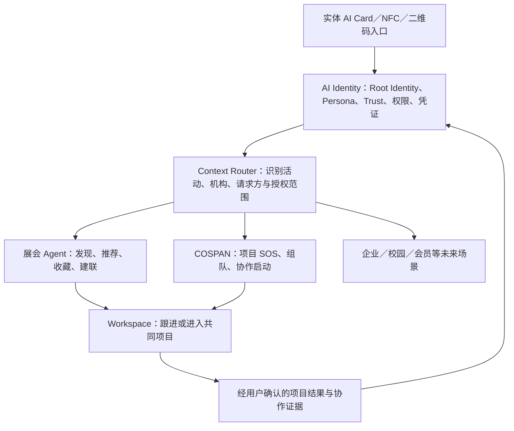

# AI Identity Card × COSPAN × 展会 Agent 产品母纲 v0.1

> **一张卡，一个身份，多种场景；身份由用户掌控，能力由证据支撑，连接由 Agent 推荐，协作在 Workspace 中发生。**

## 0. 文档目的与结论

本文用于统一三个容易混在一起的概念：**AI Identity 是底层身份与授权基础设施，展会 Agent 是“发现与有效连接”场景，COSPAN 是“连接后组队与共同开工”场景。**实体卡只是进入这些场景的统一入口，不是产品价值本身，也不是未经合作即可兼容所有门禁、交通、支付和法定证件的“万能卡”。

整个产品可以浓缩为：

> **以统一但不可被跨场景追踪的数字身份为底座，根据场景加载不同 Persona、Trust、Agent 和 Workspace；先帮助用户找到值得连接的人，再帮助人和 Agent 一起把事情做成。**

当前仍处于产品假设与试点阶段。身份、隐私和技术边界可以先冻结；付费方、首个展会合作对象、跨活动留存与机构接入意愿仍需真实验证。

---

## 1. 产品认知的起点

这次黑客松带来的核心认知，不只是“某个项目获奖”，而是理解资源方为什么愿意支持一个创新方案：真正有穿透力的产品，常从一个细小、真实、尖锐的问题切入，同时创造三种价值。

1. **用户价值：** 问题足够具体、痛点足够强，用户愿意改变行为或付出成本。
2. **合作方价值：** 方案能自然扩展品牌、硬件或机构现有产品的使用场景。
3. **故事价值：** 方案能够被快速理解、演示和传播，并形成可继续投入的产品叙事。

因此，今后判断 Idea 的标准不是技术是否复杂，而是：**需求是否真实具体、用户价值是否成立、合作方是否获得增量、方案是否能被快速验证。**

这套标准同样适用于 AI Identity Card：如果它只是把二维码换成 NFC，价值不成立；只有当它显著提升场景中的发现、信任、连接或协作效率时，卡片才有存在意义。

---

## 2. 问题定义与 Why Now

### 2.1 用户侧问题

在黑客松、展会、行业活动等高密度线下场景中，用户通常面临：

- 人和信息很多，但不知道谁与自己当前目标真正相关；
- 个人主页和电子名片主要描述“我是谁”，无法表达“我此刻想做什么、缺什么”；
- 能力标签大多是自我声明，缺少作品、项目和协作结果等证据；
- 交换联系方式容易，理解“为什么认识”以及形成后续行动很难；
- 同一人参加不同活动需要重复建档、重复领卡，并被迫展示同一套身份；
- 现有工具分别负责名片、社交、组队和任务，但完整链路被割裂。

### 2.2 主办方与参展企业问题

- 参会者搜索成本高，优质供需双方可能始终没有相遇；
- 传统胸牌和二维码只能识别或交换联系方式，无法提升匹配质量；
- 参展企业难以高效找到潜在客户、合作方、人才或项目；
- 主办方缺少衡量“活动是否真正促成有效连接”的方法；
- 通用社交平台倾向沉淀自己的长期网络，不一定服务于主办方的品牌、流程和活动目标。

### 2.3 Why Now

- Agent 已能以较低成本完成资料结构化、需求理解、推荐解释和协作启动建议；
- NFC、二维码、H5／PWA 已能提供无需下载 App 的低门槛线下入口；
- 数字凭证、身份钱包、选择性披露和安全 NFC 已有可复用的标准及硬件基础；
- 高密度活动可以在一个时间窗口内观察完整漏斗，适合作为基础设施愿景的首个验证场。

---

## 3. 产品层级：四个问题，四种产品

| 产品或场景 | 用户核心问题 | 产品答案 | 结果深度 |
|---|---|---|---|
| 电子名片 | 我是谁，怎么联系我？ | 展示身份、交换联系方式 | 完成建联入口 |
| 展会 Agent | 在这场活动里，我应该认识谁、看什么、找谁？ | 结合身份、需求和活动上下文进行推荐 | 形成有效连接 |
| COSPAN｜合拍 | 我想做什么、缺什么人、怎样马上开工？ | 项目 SOS、成员匹配、组队确认和协作启动 | 从连接进入共同做事 |
| Hello Factory（未来场景） | 当前任务是什么、进展如何、异常交给谁？ | 任务追踪、流程协同、异常流转和执行管理 | 持续推进工作 |

不能因为这些产品都可能使用胸牌、NFC 或 Agent，就把它们视为同一种产品。它们共享底层身份与授权能力，但前台 Query、用户流程和工作空间完全不同。

---

## 4. 产品愿景与架构

### 4.1 长期愿景

用户拥有一个可携带、可验证、可自主控制展示的数字身份；进入不同场景时，不必重新成为另一个平台的“新用户”，而是调用与本场目标匹配的 Persona、凭证和 Agent 能力。

### 4.2 三层产品架构



1. **底层 AI Identity：** 管理身份、Persona、权限、隐私、能力证据、凭证和场景化外部标识。
2. **中间层场景 Agent：** 理解不同场景中的用户目标，完成推荐、解释、路由与行动建议。
3. **上层 Workspace：** 承载实际行为；展会中是收藏与建联，COSPAN 中是组队与首次分工，企业场景中是任务与异常流转。

统一的是用户控制的身份底座和授权体验；变化的是不同场景的 Persona、Query、规则与 Workspace。

---

## 5. 身份模型：Identity、Persona、Trust 与 Credential

### 5.1 Root Identity：系统内部的身份根

Root Identity 用于关联用户长期持有的信息、凭证和协作历史，但不应直接暴露给所有外部机构。它可能包含教育与职业经历、项目、作品、能力、活动、任务和协作记录。

### 5.2 Persona：本次选择以什么身份出现

Persona 是用户针对某个场景主动选择的展示层。例如同一人可以在黑客松中展示“视觉设计师，寻找 Agent 开发者”，在行业展会中展示“AI 产品发起人，寻找主办方和硬件合作伙伴”，在招聘活动中只展示求职相关经历。

Persona 必须满足：

- 用户自主创建、修改、授权和撤回；
- 与具体活动或机构绑定，并可设置有效期；
- 默认不继承全部长期身份信息；
- 支持面向不同对象展示不同字段；
- 用户能理解“谁在什么目的下请求哪些信息”。

### 5.3 Trust：声明背后的证据强度

系统不应给整个人生成一个总分，而应说明每项声明由什么证据支持。

| 状态 | 含义 | 示例 |
|---|---|---|
| 自我声明 | 用户自己填写，尚无外部材料 | “熟悉 React” |
| 材料支持 | 关联作品、文档、仓库或论文 | React 项目仓库与演示 |
| 来源验证 | 学校、公司、赛事、平台等签发或确认 | 黑客松参赛／获奖凭证 |
| 协作验证 | 曾共同做事的人确认具体行为 | 队友确认其完成前端交付 |
| 行为证据 | 系统记录到已确认的任务或项目结果 | 已验收的任务与交付物 |
| 系统推断 | AI 基于材料提出的解释或候选标签 | “可能具备 Agent 产品经验” |

AI 可以总结、发现矛盾、推荐标签，但不能成为强身份真伪的最终来源；“系统推断”必须与“已验证事实”清楚区分。

### 5.4 Credential：机构独立签发的凭证

活动方、学校、企业、会员机构等仍保留自己的发行权、密钥和撤销规则。AI Identity Wallet 负责让用户接收、持有和按需出示这些凭证，而不是由平台自行冒充机构签发。

### 5.5 Pairwise ID：一机构一标识

一张物理卡可以统一，一个对外暴露的全局 ID 不能统一。正确模型是：

```text
系统内部：Root Identity 001
展会 A：Persona ID A938
黑客松 B：Persona ID B421
公司 C：Employee ID C774
```

不同机构默认无法通过外部 ID 拼接用户跨场景轨迹；只有用户明确同意，才允许关联。

---

## 6. 场景一：展会 Agent

### 6.1 产品目标

> **在有限活动时间内，提高参会者、参展企业与内容之间的有效连接效率。**

卡片只负责打开场景；核心是身份表达、需求采集、场景化推荐、用户自主建联和聚合运营分析。

### 6.2 关键角色与价值

| 角色 | 目标 | 产品价值 |
|---|---|---|
| 参会者／观众／投资人 | 找到值得看的展位、内容与人 | 缩短搜索路径，获得可解释推荐 |
| 参展企业／项目方 | 找到客户、合作方、人才或资源 | 获得更匹配且由用户授权的线索 |
| 主办方／策展方 | 提升活动体验和整体连接效率 | 获得品牌化服务与聚合运营数据 |

### 6.3 核心流程

```text
注册或复用 Identity
→ 主办方签发本场参会凭证
→ 用户创建展会 Persona 并填写目标
→ Agent 推荐企业、展位、内容和个人
→ 用户查看理由与证据
→ 收藏、主动碰卡或发起建联请求
→ 双方同意后交换被授权的信息
→ 活动后有限度跟进
→ 有共同项目时进入 COSPAN Space
```

### 6.4 主办方数据边界

在没有额外授权时，主办方适合看到：激活率、Persona 完成率、推荐查看量、自愿建联总量、主题热度、推荐满意度等聚合数据。

主办方不应默认看到：张三具体联系了李四、私人聊天内容、跨活动关系、后续合作细节以及用户未授权的完整身份。企业线索回传必须有清晰目的和用户同意。

---

## 7. 场景二：COSPAN｜合拍

### 7.1 产品目标

> **让黑客松和高密度共创现场中的陌生人，更快找到互补搭档，并从认识直接进入共同开工。**

展会 Agent 回答“谁值得认识”，COSPAN 回答“认识以后怎样一起做事”。二者共享身份底座，但 COSPAN 不应为适应展会而退化成电子名片。

### 7.2 核心流程

```text
加入活动并加载协作 Persona
→ 填写能力、意图、投入边界与团队状态
→ 发布项目招募或短时 SOS
→ 系统推荐人、项目与团队缺口并解释原因
→ 线下主动碰卡，或通过 NFC／二维码／在线请求建联
→ 双方澄清意图并确认项目方向
→ 邀请与确认入队
→ 进入 COSPAN Space
→ Agent 提出角色覆盖、风险和首批任务
→ 人类确认分工并在既有工具中执行
→ 关键结果回写为协作证据
```

### 7.3 COSPAN Space 的边界

第一版是“项目启动舱”，不是新的飞书、Notion 或 GitHub：

- 负责方向确认、团队形成、首次分工、关键变更和贡献确认；
- Agent 只能提出建议，人类确认后才成为正式任务或计划；
- 日常聊天、文档和代码执行继续进入已有工具；
- 协作结果经相关成员确认后，才可回写 Trust 证据。

---

## 8. 实体 AI Card 的准确定位

### 8.1 它是什么

> **一个实体化的身份钱包与场景调用入口。卡片是钥匙，不是档案柜。**

卡片适合保存随机化标识、安全密钥、动态认证参数和身份服务入口，不应明文保存姓名、手机号、完整履历、身份证号、关系数据和全部能力标签。

### 8.2 它不是什么

平台无法在没有机构合作、密钥和设备改造的情况下，让同一张卡直接刷开所有既有门禁、地铁、银行 POS、校园系统和政府证件系统。

准确表达是：

> **统一的是实体载体、身份入口和用户授权体验；不统一的是各机构的发行权、密钥、权限规则和清算体系。**

### 8.3 三种实现深度

| 层级 | 实现方式 | 适用阶段 | 主要限制 |
|---|---|---|---|
| 统一链接卡 | NFC 写入随机链接或 ID，由云端按场景路由 | POC／MVP | 易复制、依赖网络、不能直接兼容离线门禁 |
| 安全身份卡 | 芯片产生动态认证数据，后端验证真卡、防重放、支持挂失 | 正式活动试点／商业版 | 成本、密钥管理和服务端验证复杂度增加 |
| 多应用智能卡 | 芯片内运行彼此隔离的机构应用 | 机构规模化接入 | 每家机构都必须同意接入其应用、密钥与设备规则 |

当前最合理的路线是：**先用手机可读的 NFC／二维码验证产品流程，再按真实攻击风险升级动态认证；不因长期愿景提前建设多应用卡。**

---

## 9. 第一阶段 MVP

### 9.1 要验证的核心假设

1. 用户是否愿意维护一份针对当场目标的 Persona，而不只是静态个人主页？
2. 可解释推荐是否比名册、群聊和随机交流更容易促成有效连接？
3. 连接后提供组队与启动包，是否能提高真正共同开工的比例？
4. 同一 Identity 与实体入口能否在黑客松和展会中加载不同 Persona 与功能，且不要求用户重复建档？
5. 用户是否理解并信任场景化授权与 Pairwise ID 的隐私设计？

### 9.2 In Scope

- 一个 Root Identity，多套场景 Persona 与一机构一标识；
- 用户资料、能力标签、作品／项目证据与公开权限；
- 活动 Context、参与凭证和场景路由；
- NFC 与二维码双入口，H5／PWA 无需下载 App；
- 人、企业、项目和团队缺口的结构化资料；
- 规则兜底、AI 解释的推荐机制；
- 用户自愿收藏、建联、联系方式交换与撤回；
- COSPAN 项目 SOS、入队、首次分工和关键结果回写；
- 主办方仅查看聚合活动指标；
- 卡片挂失、替换和入口失效。

### 9.3 Out of Scope

- 银行支付、公共交通、政府身份、医保社保和传统门禁全面兼容；
- 完整的多应用智能卡与全离线验证；
- 公开的个人信用总分或综合“匹配度”；
- 类小红书内容社区、类招聘市场和大型社交网络；
- 完整聊天、在线文档、代码托管和通用项目管理；
- 主办方查看私人关系、对话或跨活动轨迹；
- Agent 在无人工确认时公开资料、决定组队或签发强信任结论。

### 9.4 Future

- 安全 NFC 动态认证、机构凭证签发与撤销；
- 活动后跟进、重复合作关系和跨活动 Identity 复用；
- 学校、企业、共享空间、会员机构和园区连接器；
- 经用户授权的企业线索流转；
- 企业／工厂中的任务、流程和异常协作模块；
- 需求成立后再评估门禁、闭环支付或多应用卡。

---

## 10. 用户故事与功能要求

### 10.1 关键用户故事

| ID | 用户故事 | 优先级 |
|---|---|---|
| US-01 | 作为参与者，我希望为本场活动选择展示身份和有效期，以免暴露全部长期资料 | P0 |
| US-02 | 作为参与者，我希望说明想认识谁、想做什么和能贡献什么，以获得与当前目标有关的推荐 | P0 |
| US-03 | 作为参与者，我希望看到推荐理由、能力证据和待确认问题，以便自己判断是否联系 | P0 |
| US-04 | 作为参与者，我希望自主决定是否建联和交换哪些信息，以掌握关系与隐私 | P0 |
| US-05 | 作为黑客松参与者，我希望发布团队缺口或短时 SOS，以快速找到帮助 | P0 |
| US-06 | 作为已建联成员，我希望确认方向、入队和首次分工，以便马上开始协作 | P0 |
| US-07 | 作为参展企业，我希望被真正有相关目标的参会者发现，以提高有效线索质量 | P1 |
| US-08 | 作为主办方，我希望看到聚合连接效率指标，以评估活动价值而不监控个人关系 | P1 |
| US-09 | 作为用户，我希望复用同一实体入口进入另一活动，并加载不同 Persona，以减少重复建档 | P1 |

### 10.2 可测试的功能要求

#### 身份与隐私

- **FR-ID-01：** 系统必须为每个外部机构或活动生成与 Root Identity 不同的 Pairwise ID。
- **FR-ID-02：** 用户必须能逐字段控制 Persona 的公开对象、目的和有效期，并能撤回授权。
- **FR-ID-03：** 每项 Trust 声明必须标注来源类型；系统推断不得显示为机构验证事实。
- **FR-ID-04：** 卡片挂失后，旧入口必须失效，新卡不得要求用户重建长期身份。

#### 推荐与建联

- **FR-MATCH-01：** 推荐结果必须展示理由、支持证据和至少一个待确认信息，不向用户展示综合人际评分。
- **FR-MATCH-02：** 规则召回必须在大模型不可用时仍能输出基础推荐。
- **FR-CONN-01：** 单方 NFC、二维码和在线入口只能发起请求；主动双卡碰触可按明确规则记录双方现场同意。
- **FR-CONN-02：** 建联不得自动公开未授权联系方式、自动入队或自动创建项目。

#### 场景与协作

- **FR-CTX-01：** 系统必须根据活动凭证或用户选择加载对应 Persona、规则与 Workspace。
- **FR-EX-01：** 展会场景必须支持人、企业、展位和内容推荐，以及收藏和自愿建联。
- **FR-COS-01：** COSPAN 必须区分正式招募与短时 SOS，并记录不同的完成结果。
- **FR-COS-02：** 成员必须分别确认方向与入队；Agent 不得自动替用户接受团队邀请。
- **FR-COS-03：** Agent 生成的分工只能作为建议，成员确认后才进入正式计划基线。
- **FR-DATA-01：** 主办方默认只能读取活动级聚合数据；个人关系明细需要独立、明确授权。

---

## 11. 关键体验边界与异常场景

| 场景 | 预期行为 |
|---|---|
| 用户拒绝资料请求 | 继续提供不含敏感信息的基础体验，不以暗示或默认勾选强迫授权 |
| Persona 已过期或用户已入队 | 暂停旧状态推荐并提醒用户更新，避免继续产生无效联系 |
| 卡片丢失或被复制 | 用户可立即挂失；安全版本拒绝无效认证或重放请求 |
| 无网络或 NFC 不可用 | 提供二维码或短链接兜底，并明确哪些能力无法离线完成 |
| 用户没有安装 App | 通过 H5／PWA 完成激活、查看、建联和基础协作流程 |
| 外部凭证被撤销 | Wallet 与场景方应能检查状态，不再将其作为有效来源验证展示 |
| AI 总结与原材料冲突 | 保留来源链接，标记为系统推断，并允许用户修正或拒绝公开 |
| 主办方请求个人关系名单 | 默认拒绝；只有目的明确、范围最小且用户单独同意时才开放 |
| 同一用户进入另一活动 | 创建新的 Pairwise ID 与 Persona，不默认向新活动暴露旧活动轨迹 |

---

## 12. 数据闭环与潜在壁垒

长期壁垒不是 NFC、AI 标签或卡片造型，而是以下闭环：

```text
已有身份与证据
→ 场景 Persona
→ 可解释推荐
→ 用户自主连接
→ 组队或协作
→ 经确认的任务、交付与反馈
→ 新的 Trust 证据
→ 改善下一次场景判断
```

有价值的数据包括：经用户确认的能力证据、推荐原因、是否接受、是否入队、是否完成 SOS、是否启动任务、项目是否完成以及是否重复合作。它们必须可撤回、可校正、可解释，并与“发起归属”“当前治理权限”“实际贡献”分别记录。

在形成足够多的真实结果前，只能说产品拥有**差异化闭环和潜在数据积累路径**，不能声称已经形成网络效应或不可复制壁垒。

---

## 13. 商业与合作关系

### 13.1 多边价值

| 一方 | 获得的价值 | 可能承担的成本／付费 |
|---|---|---|
| 个人用户 | 少重复建档、更高质量连接、可携带协作身份与证据 | 完善资料、管理授权；未来可选增值服务 |
| 参展企业／项目方 | 被更匹配的用户发现、获得经授权的有效线索 | 展位增值包、线索或活动服务费 |
| 主办方／策展方 | 品牌化智能活动体验、连接效率和聚合洞察 | 项目实施费、活动 SaaS 或年度基础设施费 |
| 凭证签发机构 | 以标准方式签发、撤销并验证成员资格 | 系统接入、管理后台或连接器费用 |

### 13.2 合作方原则

- 白标或品牌化能力可以服务主办方，但用户身份与私人关系不因此归主办方所有；
- 第三方社交平台可作为证据或联系方式来源，但不应控制核心身份入口；
- 硬件赞助商的价值应来自真实新场景和产品故事，而不是为了拿奖生硬拼接硬件；
- 是否收费、向谁收费以及按活动还是按年度收费，必须通过真实试点验证，当前不作为已确认商业模式。

---

## 14. 成功指标

当前没有可靠基线。以下数值是首轮试点的**验证门槛假设**，需在确定活动规模和参与者结构后校准。

| 层级 | 指标 | 首轮目标 | 验证周期 |
|---|---|---:|---|
| 激活 | 受邀用户激活率 | ≥ 60% | 单场活动 |
| 身份 | 激活用户完成场景 Persona 的比例 | ≥ 70% | 单场活动 |
| 推荐 | 推荐曝光后查看理由／证据的比例 | ≥ 40% | 单场活动 |
| 连接 | 查看推荐后发起或接受有效建联的比例 | ≥ 25% | 单场活动 |
| 协作 | 已建联用户进入团队或完成一次 SOS 的比例 | ≥ 30% | 黑客松单场 |
| 启动 | 已入队团队完成首次分工确认的比例 | ≥ 70% | 黑客松单场 |
| 体验 | 用户能准确复述推荐原因的比例 | ≥ 70% | 现场抽样 |
| 主办方价值 | 主办方认为聚合数据能帮助评估活动的关键负责人比例 | ≥ 80% | 试点复盘 |
| 跨场景 | 第二场活动直接复用 Identity 而不重建资料的比例 | ≥ 40% | 两场活动 |
| 留存 | 活动后 30 天仍补充结果、回应跟进或复用身份的比例 | ≥ 20% | 30 天 |

核心北极星候选指标不是碰卡次数，而是：

> **每场活动中，由系统促成并进入明确下一步的有效协作连接数。**

其中“明确下一步”必须至少满足：双方同意建联，且发生入队、完成 SOS、预约跟进或创建协作空间之一。

---

## 15. 依赖、风险与缓解

### 15.1 关键依赖

| 依赖 | 责任方 | 当前状态 | 延迟影响 |
|---|---|---|---|
| 可控规模的真实活动与主办方合作 | 商务／产品 | 待确认 | 无法验证完整漏斗与主办方价值 |
| 参与者、企业与活动结构化数据 | 主办方／用户 | 待设计采集 | 推荐冷启动质量下降 |
| NFC／二维码入口和卡片供应 | 产品／技术／供应商 | 技术可行，型号待定 | 影响现场成功率与安全级别 |
| 身份、授权、撤回与审计机制 | 产品／技术 | 待实现 | 隐私信任与机构合作受阻 |
| COSPAN 启动舱与既有工具连接 | 产品／技术 | 已有方案，待实测 | 建联后无法证明行动增量 |

### 15.2 主要风险

| 风险 | 可能性 | 影响 | 缓解方式 |
|---|---:|---:|---|
| 用户不愿维护新的活动 Persona | 中 | 高 | 最小字段、导入已有资料、明确即时回报和自动失效 |
| 冷启动导致推荐看起来随机 | 高 | 高 | 硬条件过滤＋结构化规则兜底，AI 只负责解释和补充 |
| NFC 成为炫技，反而比二维码更慢 | 中 | 中 | 做 NFC／二维码完成时间、成功率和后续转化对照 |
| 平台被理解为监控关系的主办方工具 | 中 | 高 | Pairwise ID、最小披露、聚合后台和清晰同意记录 |
| AI 推断伤害用户或制造虚假信任 | 中 | 高 | 来源分层、可追溯证据、人工确认和申诉修正 |
| 黑客松低频，活动结束即失活 | 高 | 高 | 验证跨活动身份复用、项目结果回写与重复合作价值 |
| 机构不愿交出发行权或改造设备 | 高 | 高 | 不要求交出发行权；以连接器和标准凭证逐家接入 |
| 过早扩展门禁、支付和全场景 | 中 | 高 | 以试点退出条件控制路线图，未验证前不建设复杂硬件体系 |

---

## 16. 路线图与阶段退出条件

路线图以证据推进，不以宏大愿景倒逼一次性交付。

| 阶段 | 核心交付 | 退出条件 |
|---|---|---|
| M0：COSPAN Demo | 动态协作身份、推荐解释、建联、入队、首次分工 | 端到端流程稳定可演示，关键事件可记录 |
| M1：真实黑客松试点 | 真实用户组队与 SOS，NFC／二维码对照 | 证明至少一种入口和推荐方式优于现有流程，且建联能进入行动 |
| M2：展会 Agent 试点 | 企业／展位／个人推荐、用户自主建联、聚合后台 | 主办方与参展方确认有效连接价值，隐私边界无重大争议 |
| M3：一卡跨场景验证 | 同一 Identity 与卡片进入黑客松和展会，加载不同 Persona | 用户无需重建档案，外部 ID 不可被机构自行关联 |
| M4：安全与机构化 | 动态认证、凭证签发／撤销、连接器和审计 | 出现持续付费或强安全需求，机构愿意正式接入 |
| M5：新 Workspace 扩展 | 校园、企业、会员或园区等新场景 | 新场景复用底层能力且单位接入成本持续下降 |

不把银行卡、交通卡、身份证和政府凭证纳入近期路线图；它们需要完全不同的合规、清算、安全认证和机构授权。

---

## 17. 产品原则与对外表达

### 17.1 产品原则

1. **卡只是入口，场景价值才是产品。**
2. **前台随场景变化，底层身份由用户掌控。**
3. **一张物理卡，一个内部身份根，多套外部标识。**
4. **验证声明的证据强度，不定义一个人的价值。**
5. **AI 负责理解、解释和建议，人类负责授权、判断和承诺。**
6. **连接不是终点，进入明确行动才是有效连接。**
7. **主办方获得活动洞察，不默认获得私人关系。**
8. **长期做基础设施，第一步先证明具体场景中的增量。**

### 17.2 一句话版本

**完整愿景：**

> 一张卡，一个身份，多种场景；身份由用户掌控，能力由证据支撑，连接由 Agent 推荐，协作在 Workspace 中发生。

**展会合作：**

> 卡只是入口，AI 推荐系统才是核心；展会 Agent 提高有效连接效率，COSPAN 承接连接后的组队与协作。

**技术边界：**

> 统一的是载体、身份入口和用户体验；不统一的是各机构的发行权、密钥和权限规则。

**COSPAN：**

> 人与人先相遇，人与 Agent 再共创。

---

## 18. 开放问题

- [ ] 首个真实合作场景应优先选择黑客松、行业展会还是两者相邻发生的组合活动？
- [ ] 第一付费方更可能是主办方、参展企业、赞助商还是个人增值用户？
- [ ] 用户创建 Persona 时，哪些字段是获得有效推荐所需的最小集合？
- [ ] 哪些 Trust 来源最能改变用户决策，而不仅是增加资料丰富度？
- [ ] 主动双卡碰触作为双方建联授权，需要怎样的现场提示、撤回窗口与审计记录？
- [ ] 主办方需要哪些聚合指标才能愿意续用，同时不会诱导平台扩大个人数据收集？
- [ ] 活动后用户为何还会回来：保存关系、继续项目、积累证据，还是进入下一场活动？
- [ ] 何种攻击风险或商业需求出现后，才值得从普通 NFC 升级到安全动态认证芯片？
- [ ] COSPAN Space 应接入哪些既有工具，才能证明增量又不变成重复维护的项目管理平台？

---

## 19. 近期下一步

1. **冻结试点假设：** 明确首场活动、核心用户、唯一闭环和失败判定，不同时验证所有场景。
2. **访谈三方角色：** 分别验证参会者、参展企业和主办方对连接效率、数据边界与付费价值的判断。
3. **定义最小身份模型：** 确定 Root Identity、Persona、Pairwise ID、Trust Source 和 Consent 的最小数据结构。
4. **跑通两种入口：** 用 H5／PWA 同时验证 NFC 与二维码，先证明流程增量，再升级安全芯片。
5. **建立真实漏斗：** 统一记录激活、Persona、推荐、证据查看、建联、入队／SOS、首次分工和活动后复用。
6. **复盘后再扩展：** 只有当一场活动证明有效连接与协作转化价值后，才推进展会后台、机构凭证和跨场景复用。

---

## 20. 参考与相关文档

### 当前项目文档

- [项目导航与方向决策](./00-项目导航与方向决策.md)
- [COSPAN 产品设计 PRD](./当前方案-ToC-AI组队/01-产品设计PRD.md)
- [技术架构与 NFC 方案](./当前方案-ToC-AI组队/03-技术架构与NFC方案.md)
- [产品定位与差异化](./当前方案-ToC-AI组队/06-产品定位与差异化.md)
- [人类与 Agent 协作空间设计](./当前方案-ToC-AI组队/08-人类与Agent协作空间设计.md)
- [数据埋点与漏斗规范](./当前方案-ToC-AI组队/13-数据埋点与漏斗规范.md)

### 技术标准参考

- [W3C Verifiable Credentials Data Model v2.0](https://www.w3.org/TR/vc-data-model-2.0/)
- [OpenID for Verifiable Credential Issuance 1.0](https://openid.net/specs/openid-4-verifiable-credential-issuance-1_0.html)
- [NXP NTAG 424 DNA](https://www.nxp.com/products/rfid-nfc/nfc-hf/ntag-for-tags-and-labels/ntag-424-dna-424-dna-tagtamper-advanced-security-and-privacy-for-trusted-iot-applications%3ANTAG424DNA)
- [NXP MIFARE DESFire](https://www.nxp.com/products/rfid-nfc/mifare-hf/mifare-desfire%3AMC_53450)

### 修订记录

| 版本 | 日期 | 变更 |
|---|---|---|
| v0.1 | 2026-09-01 | 首次统一 AI Identity Card、展会 Agent、COSPAN、身份与隐私模型、技术边界、MVP 与路线图 |
