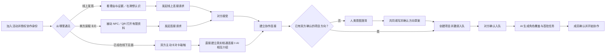
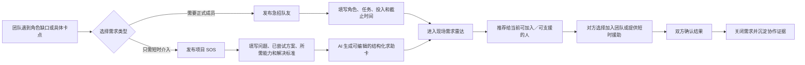
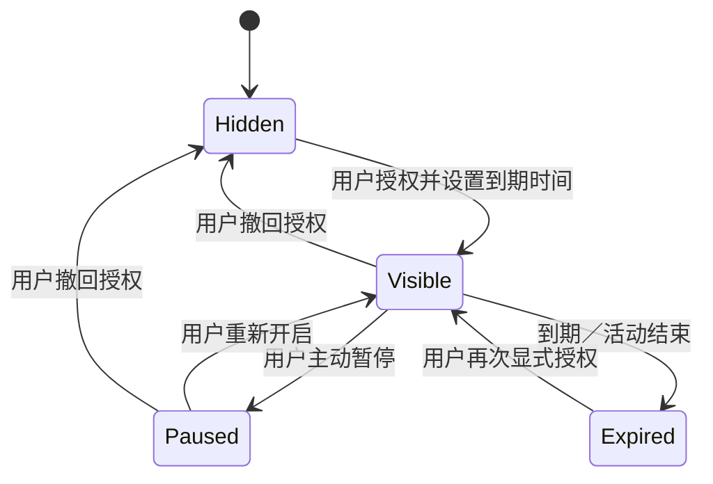
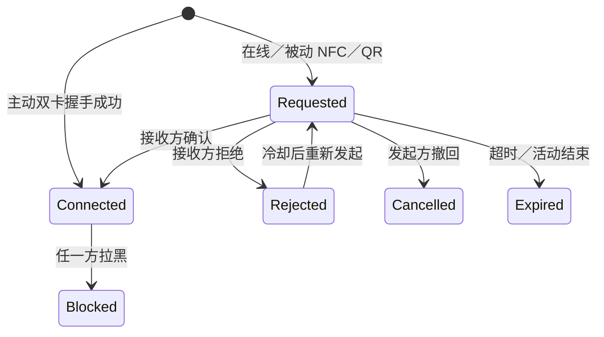
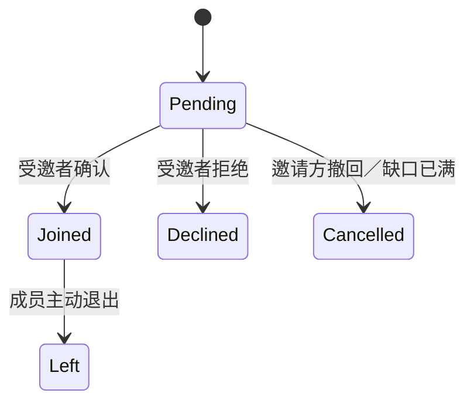
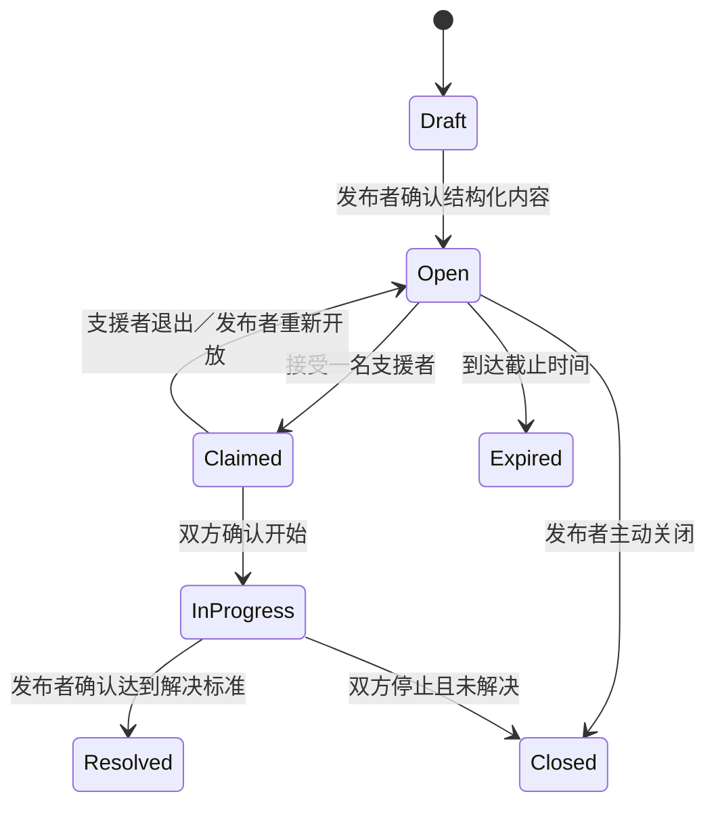
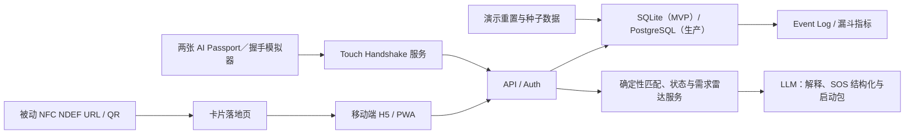
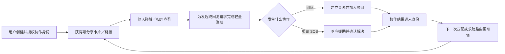

# COSPAN｜合拍 产品设计文档（PRD）

> 本文承接 [00-市场行业调研.md](./00-市场行业调研.md)。这是一个独立软件产品：同一业务与数据底座服务微信小程序、手机 App 和电脑协作空间。NFC／QR 与电子胸牌均为可选增强，不是产品主体。

> **2026-09-06 阶段更新：** 以[黑客松切入与人机协作产品策略](./docs/2026-09-06-黑客松切入与人机协作产品策略.md)为当前方向与交付范围。目标从“组队并启动三个任务”延伸至“人和 Agent 推进、提交成果、人工验收”；同时规划既有团队直入。下文未逐条更新的 96 小时需求、人员与工期为历史基线，不代表本轮承诺或实现状态。真实状态见[开发与验收清单](./docs/2026-09-06-产品上线开发与验收清单.md)。

## 文档信息

| 字段 | 内容 |
|---|---|
| 产品阶段 | 黑客松完整协作闭环开发／真实需求与复用待验证 |
| 首发场景 | 黑客松找人、匹配、组队、人机协作和成果交付 |
| 核心用户 | 未组队参赛者、Idea 发起人、存在角色缺口的团队 |
| 产品形态 | 统一后端＋微信小程序／手机 App／电脑协作空间；当前手机安装版是 WebView 封装，手机 Web/PWA 保留兼容入口 |
| 核心结果 | 从发现队友到共同确认并交付成果；长期服务更广的创作团队 |
| 本期裁决 | **全链路连通、各段克制投入；复用既有文档与代码工具，先打通一个真实、可审阅的 Agent 能力** |

### Change Log

| Version | Date | Change Description |
|---|---|---|
| 0.1 | 2026-08-28 | 基于独立 To C 定位和市场／行业调研建立首版 PRD |
| 0.1.1 | 2026-08-28 | 一致性评审：修正 §13.2 标题（原 “Four Risks” 与实际 10 条风险不符） |
| 0.1.2 | 2026-08-28 | 冻结差异化口径：不公开展示匹配度，以推荐解释替代对人评分，并关联独立定位文档 |
| 0.2 | 2026-08-28 | 新增“当前协作状态＋现场需求雷达”：急招队友、项目 SOS、可提供支援与悬赏意向；同时区分主动卡对卡直连和被动 NFC／QR 请求 |
| 0.3 | 2026-08-29 | 冻结产品品牌 COSPAN｜合拍；协作护照保留为身份能力，不再作为产品名称 |
| 0.4 | 2026-08-29 | 手机端、真实定位与协作后端进入可运行状态；发现页新增由用户控制的跨推荐／附近／名册硬门槛，不展示匹配百分比且不静默放宽 |
| 0.5 | 2026-08-30 | 中文品牌确定为“合拍”；英文 COSPAN、协作护照与 COSPAN Space 能力命名保持不变 |
| 0.6 | 2026-08-30 | 对外品牌完整锁定为“COSPAN｜合拍”，突出从真人相遇到人与 Agent 共创的完整产品语义 |
| 0.7 | 2026-09-06 | 黑客松从启动任务扩展到成果交付；统一底座三客户端；明确纯软件、既有团队与外部工具边界，保留旧 MVP 为历史基线 |

## 目录

1. [执行摘要](#1-执行摘要)
2. [问题定义与证据](#2-问题定义与证据)
3. [目标用户与 JTBD](#3-目标用户与-jtbd)
4. [战略背景与产品定位](#4-战略背景与产品定位)
5. [产品目标、非目标与设计原则](#5-产品目标非目标与设计原则)
6. [解决方案与核心用户流程](#6-解决方案与核心用户流程)
7. [信息架构与页面设计](#7-信息架构与页面设计)
8. [领域对象、状态机与匹配逻辑](#8-领域对象状态机与匹配逻辑)
9. [系统架构与 NFC 方案](#9-系统架构与-nfc-方案)
10. [功能需求与验收标准](#10-功能需求与验收标准)
11. [成功指标与埋点](#11-成功指标与埋点)
12. [本期不做](#12-本期不做)
13. [依赖、风险与缓解](#13-依赖风险与缓解)
14. [商业化、增长与壁垒路径](#14-商业化增长与壁垒路径)
15. [开放问题与决策门槛](#15-开放问题与决策门槛)
16. [PRD 自评](#16-prd-自评)

---

## 1. 执行摘要

我们拟构建面向黑客松参与者的组队与人机协作产品 **COSPAN｜合拍**。用户主动授权展示组队状态、能力、项目证据与协作意图，发现互补的人，双向确认建联后明确共同目标与投入，并进入持续协作。长期覆盖产品、设计、开发等创作团队，既有团队也应能直接建项。软件主链不依赖碰卡；电子胸牌与被动 NFC／QR 的历史设计继续作为可选入口。

产品价值不止是交换联系方式。双方建立关系后，若项目方向尚未确定，先进入由人主导的“意图澄清”：成员分别表达想服务谁、解决什么问题和验证什么结果，Agent 只整理重合点与待确认问题。只有相关成员确认方向后，才能创建项目、邀请入队，并根据成员能力和已确认目标生成角色覆盖、风险提示与首批三个任务。已有明确方向的项目可直接进入邀请确认。已经组好队的用户仍可发布“急招队友”或“项目 SOS”，向现场寻求短时技术、设计、路演或资源援助；其他用户可声明“可提供支援”，一次被双方确认解决的援助将成为新的协作证据。协作过程和项目结果未来可以反哺个人的 AI 协作身份，提高下一次匹配质量。

原 96 小时版本的验证目标（历史）：

> 一个未组队用户授权展示状态后，找到互补协作者；双方通过主动卡对卡碰触直接建立相遇连接，或经被动 NFC／QR 请求确认后建联；若方向未定，先由双方完成意图澄清并确认方向草案，再创建项目、邀请入队，系统生成可编辑的团队角色建议和首批任务。P0 稳定后，再增加一条“发布 SOS—接受援助—标记解决”的 P1 竖切。

🔶 **Assumption：** 用户会认为“更快找到互补队友并立即开始协作”的价值足以补偿填写资料、授权公开和双方确认带来的摩擦。

---

## 2. 问题定义与证据

### 2.1 Who Has This Problem?

- 第一次参加黑客松、独自到场或原队伍临时缺人的参赛者；
- 已经有 Idea，但缺少前端、后端、AI、硬件、产品、设计或路演能力的发起人；
- 已有部分成员，需要在开赛前快速补齐角色缺口的团队；
- 已经组队，但仍希望留下未来合作关系和见面上下文的人。

### 2.2 What Is the Problem?

黑客松组队目前通常由参与者自己拼接多种工具完成：

1. 在报名表、Devpost／TAIKAI 或群聊中声明自己在找队友；
2. 浏览大量自我介绍，靠关键词判断能力；
3. 在微信群、Discord 或现场随机搭话；
4. 交换微信、GitHub 或个人作品集；
5. 重复解释 Idea、角色缺口、投入时间和工作方式；
6. 拉群后再决定是否真正组队以及谁做什么。

这条链路的核心问题不是“无法加好友”，而是：

- 不知道谁当前仍然可加入或正在招人；
- 自填技能标签不能说明做过什么，也不能说明是否适合本项目；
- 项目和团队缺口分散在群消息中，检索成本高；
- 现场认识后只留下联系方式，几天后忘记为何相识；
- 匹配停留在认识，没有转化成角色、任务和实际协作；
- 单场活动结束后，协作结果没有进入下一次匹配。
- 用户完成组队后缺少继续打开产品的理由，而开发中后期仍会持续出现部署、硬件、设计、测试和路演卡点；
- 团队遇到短时关键问题时，通常只能在群里刷屏、贴纸条或随机找人，无法把问题准确路由给当前有能力且愿意支援的人。

### 2.3 Why Is It Painful?

- **未组队者：** 担心主动搭话被拒绝，也难快速证明自己能贡献什么；可能在开赛窗口结束前仍未加入合适团队。
- **Idea 发起人：** 时间紧、候选人多但证据少，容易按熟人关系或单一技能标签组队。
- **缺人团队：** 在多个群和线下场地反复广播需求，无法确认候选人是否仍可加入。
- **整个团队：** 即使组队成功，也可能因角色重叠、任务不清或承诺不一致，在数小时后再次拆队。

### 2.4 Evidence Ledger

| Evidence | Type / Strength | Reading |
|---|---|---|
| Devpost、TAIKAI 已提供找队友、团队邀请、聊天或项目提交能力 | 官方产品资料／中高 | 找队友是持续存在的场景，不是凭空假设 |
| YC Co-Founder Matching、CoffeeSpace 已验证资料、推荐、邀请和双向确认范式 | 官方产品资料／中高 | “项目型人才匹配”行为存在，但个人付费未被证明 |
| Grip、Brella、Klik、Mobilo 等覆盖活动匹配或 NFC 建联 | 官方产品资料／中高 | AI networking 与碰触建联均不是空白能力 |
| 黑客松研究强调能力互补、团队形成和社交关系的重要性 | 学术研究／中 | 支持问题重要，不直接证明本产品解法成立 |
| 目标用户在现有工具之间可能存在协作交接缺口 | 早期市场扫描假设／待验证 | 不能据此宣称没有同类产品；须核验最新竞品与真实团队流程，也可能是低频、低付费 dead zone |
| 尚无本团队真实活动漏斗、访谈原话和个人付费数据 | 证据缺口 | 不能宣称产品市场匹配或商业闭环已经成立 |

详细来源、竞品与反向证据见 [00-市场行业调研.md](./00-市场行业调研.md)。

---

## 3. 目标用户与 JTBD

### 3.1 Primary Persona：未组队参赛者

- **Context：** 独自或临时到场，希望参赛，但没有稳定队伍；活动开始前只有几十分钟到数小时完成组队。
- **Goals：** 被真正缺少自己能力的人发现；快速判断对方项目是否值得加入；降低陌生人搭话成本。
- **Pain points：** 群消息噪声大、自我介绍重复、项目真假难判断、不了解团队协作方式。
- **Current behavior：** 发群自我介绍、扫报名墙、现场随机交流、交换微信和 GitHub。
- 🔶 **Assumption：** 愿意在一个限定活动内公开最小能力资料，并接受到期自动隐藏。

### 3.2 Secondary Persona：Idea 发起人

- **Goals：** 按项目目标快速补齐角色缺口，优先看到有证据且当前可加入的人。
- **Pain points：** 候选人的技能标签泛化；短时间内很难同时判断能力、兴趣、投入和协作偏好。
- **Need：** 创建简短项目卡、声明最多三个关键缺口、看到匹配理由与一项风险提醒。

### 3.3 Secondary Persona：缺人的团队

- **Goals：** 让团队缺口在活动范围内被发现；向候选人发出明确邀请；避免同一席位重复邀请。
- **Pain points：** 群内广播不可追踪，候选状态变化快，团队成员不清楚谁已经联系过谁。
- **Need：** 团队卡、角色缺口、邀请状态、成员确认和团队启动包。

### 3.4 Extended Persona：协作关系维护者

- **Goals：** 保存“在哪里认识、为什么连接、合作过什么”，未来再次发起项目时可以复用关系。
- **Boundary：** 这是长期留存方向，不是 96 小时版本的首要用户。

### 3.5 Extended Persona：项目求助方与现场支援者

- **项目求助方：** 团队和方向已经明确，但在某个可描述的技术、设计、部署、测试、路演或设备问题上受阻；需要的是短时介入，不一定需要新增正式成员。
- **现场支援者：** 已经组队或暂时空闲，愿意用 10–60 分钟帮助其他团队；希望快速判断问题是否属于自己的能力范围，并让真实贡献被双方确认后进入协作记录。
- **Boundary：** “急招队友”以加入团队为结果；“项目 SOS”以解决具体问题为结果，两者不得混为同一个招募动作。

### 3.6 Jobs-to-Be-Done

- **Functional job：** 在有限时间内发现并确认一名能补齐项目缺口、当前可加入、且愿意合作的人。
- **Emotional job：** 降低陌生人搭话和被拒绝的不确定感，让我知道这次接触有明确理由。
- **Social job：** 让我以真实项目与能力证据被理解，而不是只靠头衔或夸张自我介绍。
- **Continuation job：** 连接成立后马上形成角色和下一步，避免“加了好友然后没有然后”。
- **Rescue job：** 当项目已经接近完成但卡在关键环节时，把问题整理成现场其他人能快速判断的援助任务，并在截止时间前找到可介入的人。
- **Contribution job：** 当我愿意短时帮助其他团队时，让合适的真实问题找到我，并把经确认的解决结果沉淀为能力证据，而不要求我退出或改变自己的团队。

---

## 4. 战略背景与产品定位

### 4.1 Why This, Why Now?

- 开发者、AI builder 和黑客松活动形成持续、可触达的高密度人群；
- AI 已能低成本完成资料结构化、互补性解释和协作启动建议；
- 被动 NFC 标签和二维码可以用一个 Web URL 覆盖 iOS／Android；
- 现有活动平台、职业身份、即时通讯和协作工具仍分属不同阶段；
- 黑客松本身就是可现场验证网络密度、转化和传播的测试环境。

### 4.2 Positioning

> 面向需要在短时间内组建项目团队的个人，AI 组队与协作产品是一个可授权、可解释、可持续积累的协作身份网络。它不仅推荐人，还把线下见面转化为双方确认的关系与可执行的团队启动方案；实体卡片只是跨手机生态的可选入口。

完整竞品边界、签名闭环、壁垒阶段与路演表述见 [06-产品定位与差异化.md](./06-产品定位与差异化.md)。

### 4.3 What It Is / Is Not

| It is | It is not |
|---|---|
| 面向个人的 AI 协作身份与匹配产品 | 黑客松主办方管理 SaaS |
| 人、项目和团队缺口的双向匹配 | 只按标签刷人的相亲式社交 App |
| 双方同意后才成立的协作关系 | 碰一下就泄露联系方式或自动加好友 |
| NFC／QR 作为线下入口 | 依赖电子硬件销售成立的硬件项目 |
| 从连接继续到团队角色和首批任务 | 完整聊天、项目管理或代码托管平台 |

### 4.4 Epic Hypothesis

> 我们相信，为黑客松参与者提供“临时可见的证据化协作身份＋面向团队缺口的匹配＋两类线下建联＋协作启动包＋现场需求雷达”，能够提高有效协作结果并缩短组队或解除项目卡点的时间，因为用户当前需要在群聊、现场交流、GitHub 和协作工具之间重复筛选和解释。若用户不愿授权展示、AI 推荐不优于标签筛选、碰卡没有体验增量、或 SOS 无法比群聊更快获得有效回应，则对应假设不成立。

---

## 5. 产品目标、非目标与设计原则

### 5.1 96 小时产品目标

1. 证明用户可以显式开启、暂停和自动到期“可被发现”状态；
2. 证明系统能把人、项目和团队缺口做成一条有解释的匹配；
3. 证明主动卡对卡碰触与被动 NFC／QR 是两条不同链路：前者以双方物理动作直接建立相遇连接，后者只打开有限公开页并发起请求；
4. 证明任何连接来源都不会自动暴露手机号等私密信息，也不会自动加入团队；
5. 证明未确定项目方向的连接必须先经人类意图澄清和双方方向确认，随后才能转化为项目与入队，并在 `COSPAN Space｜人机协作空间` 的启动阶段由 Agent 提出角色／任务建议、由成员认领调整并最终确认；
6. 记录完整漏斗，用数据判断下一步，而不是只完成展示。

### 5.2 96 小时非目标

- 不证明全国市场规模和长期留存；
- 不证明个人已经愿意订阅；
- 不取代微信、Discord、GitHub、飞书或 Notion；
- 不实现原生 iOS／Android 双端应用；
- 不实现手机与手机直接 NFC 通信；
- 不构建主办方后台、招聘后台或 CRM；
- 不做复杂社交信息流和完整聊天系统。

### 5.3 Design Principles

1. **用户主动授权：** 默认不可见；公开范围、公开内容和到期时间由用户选择。
2. **证据优于标签：** 技能标签必须尽量绑定作品、代码或项目；AI 不凭空替用户补能力。
3. **不对人公开打分：** 内部可用结构化分数排序；用户只看到推荐理由、能力证据和待确认问题，不展示综合匹配百分比。
4. **意愿与动作一致：** 主动卡对卡碰触本身即双方建联授权，可直接创建“真实相遇连接”；单方点击、被动 NFC 或二维码只发起请求。任何连接都不能自动加入团队或公开敏感联系方式。
5. **H5 先于下载：** 接收方无需安装 App 就能查看有限资料；登录后才可发起连接。
6. **AI 建议、人类决定：** AI 可建议匹配、角色和任务，不自动同意连接或替用户入队。
7. **从连接到行动：** 每个成功连接都应有清晰的下一步，而不止交换联系方式。
8. **启动而不重复维护：** COSPAN Space 负责首次分工、关键变更与贡献确认；日常沟通和执行进入飞书、GitHub 等已有工具，用户不得被要求在两套任务系统重复更新状态。
8. **状态真实且短效：** “未组队／缺人”会过期，避免把已失效用户继续推荐给别人。
9. **确定性主链：** 匹配筛选、权限、状态和幂等由规则控制；大模型失败不能阻断组队。
10. **硬件可删除：** 没有 NFC 卡时，二维码和普通分享链接也能完成同一软件闭环。
11. **求助不等于招人：** 急招以正式入队为目标；SOS 以解决一个明确卡点为目标，支援者无需改变团队归属。
12. **短效需求优先：** 急招和 SOS 必须声明截止时间、期望结果并自动过期；已解决需求不得继续占用现场注意力。
13. **结果由双方确认：** AI 可整理问题和推荐支援者，但不能擅自宣称问题已经解决或把援助写成公开能力背书。

---

## 6. 解决方案与核心用户流程

### 6.1 Product Components

| Component | User value | 96h form |
|---|---|---|
| AI 协作身份 | 展示当前状态、能力、证据和协作偏好 | 移动端资料卡＋编辑页 |
| 手机端发现 | 在同一入口中按推荐、附近和名册浏览已授权成员 | 96h 使用同一候选集模拟；真实 BLE 仅属于赛后手机前台模式 |
| 活动空间 | 把可匹配范围限定在同一黑客松 | 邀请码／预置活动 |
| 人／项目／缺口匹配 | 解释谁和谁互补 | 候选卡＋结构化评分＋AI 文案 |
| 主动卡对卡建联 | 把双方有意识的物理碰触直接变成真实相遇连接 | AI Passport 模拟握手＋双端成功反馈 |
| 被动 NFC／QR 入口 | 单方跨生态打开资料并归因 | 被动标签写 URL＋同 URL 二维码 |
| 请求与同意 | 保护非对称入口下的隐私和意愿 | 请求箱＋接受／拒绝／拉黑 |
| 轻量团队 | 把关系转成成员和角色 | 项目卡＋缺口＋团队邀请 |
| AI 启动包 | 让团队马上开始 | 角色覆盖、风险提醒、首批 3 个任务 |
| 当前协作状态 | 表达现在是找队、发起组队、团队补位还是只开放交流 | 主状态＋实时信号＋可见期限 |
| 现场需求雷达 | 将急招和具体项目卡点路由给现场合适的人 | P1：需求卡＋援助响应＋解决确认 |
| 事件与指标 | 验证真实增量 | 漏斗事件、来源字段、演示重置 |

### 6.2 End-to-End Flow



右滑只表达“想认识”，不是碰卡的前置条件。两个人可以从线上发现走向请求，也可以在完全没有浏览过彼此资料的情况下，因现实交流而直接碰卡建联。

### 6.3 现场需求雷达流程（P1）



需求发布者可以标记“无偿互助／实物感谢／平台积分／有偿悬赏意向”。96 小时版本只记录和展示悬赏意向，不处理真实资金；活动规则禁止外援或付费协助时，活动空间必须关闭相应选项。

### 6.4 评委主演示故事

1. 用户 A 是一名硬件开发者，进入活动后选择“未组队”，授权在活动结束前展示；
2. 用户 B 想做一个 AI 硬件方向，但尚未与搭档确认服务对象、问题和验证结果；
3. B 的发现页推荐 A，显示两个互补理由、一项作品证据和一个待确认点；
4. B 在现场找到 A，双方主动碰触各自的 AI Passport；系统直接建立“真实相遇连接”，两台手机显示 AI 生成的相互介绍；
5. 如果只有被动卡，则 B 通过 NFC／QR 打开 A 的有限公开页并发起请求，A 接受后建联；
6. A 与 B 分别表达意图，共同填写方向草案；Agent 只整理重合点，双方分别确认方向；
7. B 创建项目并邀请 A 入队，A 确认；
8. AI 生成团队角色覆盖、一个风险提示和三个启动任务；
9. 团队接受其中一个任务，系统记录一条“有效协作连接”。

### 6.5 Failure / Fallback Flow

- AI 匹配不可用：按规则分数和模板化理由继续展示；
- 主动卡对卡握手不可用：降级为被动 NFC／QR；此时必须恢复请求—接受流程；
- 被动 NFC 不被读取：使用卡片上的 QR；
- 未安装 App：直接进入 H5；
- 未登录：可看有限资料，发起请求前完成轻量登录；
- 卡主离线且无法验证双卡握手：不得误报直连成功，可记录待同步事件并在双方设备上明确显示；
- 同一对用户重复碰卡：只补充相遇事件，不重复创建 Connection；
- SOS 的 AI 整理不可用：使用结构化表单和模板卡片发布，不阻断求助；
- SOS 到期或已解决：从活跃雷达移除，但保留对参与者可见的历史记录；
- 活动已结束或状态过期：资料页显示“当前不可连接”，不继续推荐；
- 网络异常：显示发送失败／待重试，不误报请求成功。

---

## 7. 信息架构与页面设计

### 7.1 Mobile Information Architecture

```text
活动首页
├── 发现
│   ├── 推荐的人
│   ├── 推荐的项目／团队
│   ├── 现场需求雷达（急招／SOS）
│   └── 候选详情／匹配解释
├── 请求
│   ├── 收到的连接请求
│   ├── 发出的连接请求
│   └── 团队邀请
├── 团队
│   ├── 项目卡与角色缺口
│   ├── 成员与角色
│   ├── AI 启动包／首批任务
│   └── 发布急招／项目 SOS
└── 我的
    ├── 协作身份
    ├── 当前协作状态与可提供支援
    ├── 可见状态与到期时间
    ├── 能力证据
    └── NFC／QR 卡片管理
```

### 7.2 Page Specification

| Page | Must show | Primary action | Empty / error state |
|---|---|---|---|
| 活动加入页 | 活动名称、时间、邀请码 | 加入活动 | 活动无效／已结束 |
| 最小资料引导 | 状态、3–5 个能力、证据链接、兴趣、投入时间 | 开启可见 | 跳过后保持不可见 |
| 发现页 | 人／项目候选、匹配理由、状态剩余时间 | 查看详情 | 暂无候选时提示完善资料或稍后刷新 |
| 现场需求雷达 | 急招／SOS 类型、技能需求、紧急性、截止时间、位置、回报方式 | 我可以加入／我可以帮 | 到期、关闭和已解决需求不得出现在活跃列表 |
| 发布现场需求 | 需求类型、问题或角色、期望结果、已尝试内容、所需能力、投入／援助时长、截止时间 | 确认发布 | AI 失败时保留结构化表单和模板预览 |
| 援助详情 | 完整问题上下文、团队、悬赏意向、响应者和状态 | 提供援助／确认开始／标记解决 | 需求被他人接手时允许候补或提示已进入处理 |
| 候选详情 | 有限资料、证据、互补点、待确认点 | 发起连接／去现场认识 | 状态过期时禁止请求 |
| NFC／QR 落地页 | 卡主有限公开资料、活动上下文 | 登录并发起请求 | 卡片停用／用户不可见 |
| 请求箱 | 请求人、来源、理由、时间 | 接受／拒绝／拉黑 | 重复请求合并显示 |
| 团队卡 | 项目目标、已有成员、最多 3 个缺口 | 邀请／确认入队 | 缺口已满时阻止重复邀请 |
| AI 启动包 | 角色建议、覆盖缺口、风险、3 个任务 | 接受／编辑一个任务 | AI 失败时显示模板任务 |
| 我的身份 | 公开预览、状态、到期时间、证据 | 编辑／暂停可见 | 清晰显示当前不可见原因 |

### 7.3 Interaction Rules

- 每页只保留一个主行动，避免现场高压环境下的多选；
- “公开中／已暂停／即将到期”状态在首页和我的页始终可见；
- 主动卡对卡碰触可直接建立相遇连接；接受被动入口产生的请求和接受入队仍是两个不同确认，不暗中合并；
- “急招队友”与“项目 SOS”使用不同主按钮：前者是申请／邀请入队，后者是提供短时援助；
- “有偿悬赏”必须同时展示金额、交付标准和“平台暂不托管资金”提示；赛事禁用时不得显示发布入口；
- 证据链接使用可点击来源，AI 摘要不能替代原始证据；
- 匹配分数不直接展示为虚假的精确百分比，优先展示可读理由；
- 不公开手机号、微信号、邮箱等联系方式；建立关系后也由用户自主决定是否分享。

---

## 8. 领域对象、状态机与匹配逻辑

### 8.1 Core Domain Model

| Entity | Key fields | Purpose |
|---|---|---|
| User | user_id、昵称、头像、登录标识 | 账户主体 |
| Event | event_id、名称、起止时间、邀请码 | 限定发现和状态有效范围 |
| Collaboration Profile | 技能、兴趣、偏好、证据、投入时间 | 用户可编辑的协作身份 |
| Visibility Grant | 范围、公开字段、开始／到期时间、状态 | 记录显式授权，而不是资料默认公开 |
| Evidence | 类型、URL、标题、所有者、验证状态 | 支撑能力标签的项目／作品证据 |
| Project | 目标、主题、阶段、created_by、团队状态 | Idea／团队的协作对象；创建者不等于永久 Leader |
| Project Origin | 最初 Idea、发起人／共同发起人、确认记录 | 永久保存项目 0→1 来源，与治理权限分开 |
| Direction Version | 用户、问题、结果、父方向／被替代方向、状态 | 用 Pivot 或 Fork 保存方向演进，不覆盖旧 Idea |
| Direction Origin | direction、发起人／共同发起人、确认记录 | 每个被采用方向独立保存 0→1 发起归属 |
| Leadership Term | project、direction／phase、leader、开始／结束、产生方式 | Leader 按当前方向和阶段确认、复核与交接 |
| Role Need | 角色、重要性、数量、说明、urgency、expires_at、状态 | 定义团队真正缺什么；急招是带紧急标记和期限的 Role Need |
| Match Candidate | source、规则分、理由、风险、生成时间 | 人—项目／人—人推荐结果 |
| NFC Asset | card_id、opaque_token、owner、启用状态 | 将实体入口映射到有限公开资料 |
| Touch Handshake | 双方 card_id／user_id、event、challenge、时间、验证状态 | 记录主动双卡物理授权并幂等创建相遇连接 |
| Connection Request | requester、recipient、source、event、状态 | 记录发起与双向确认 |
| Connection | 两个用户、event、source、consent_mode、context、created_at | 请求被接受或双卡握手成功后的协作关系 |
| Team Invitation | project、invitee、inviter、状态 | 把连接转成项目成员 |
| Team Membership | project、user、team_role、governance_role、状态 | 团队职能与治理权限分开记录 |
| Aid Request | project、类型、问题、已尝试、所需能力、期望结果、紧急性、地点、截止、回报方式、状态 | 表达不以入队为前提的短时项目援助需求 |
| Aid Offer | aid_request、helper、可用时间、说明、状态 | 支援者响应一条 SOS |
| Aid Session | aid_request、requester、helper、开始／结束、结果、双方确认 | 记录实际发生并可能沉淀为证据的援助过程 |
| Collaboration Pack | role_map、gap、risk、tasks、version | AI 生成、成员可编辑的启动建议 |
| Event Log | actor、event_type、source、object、timestamp | 漏斗、审计、幂等和演示归因 |

### 8.2 当前协作状态与实时信号

主状态是互斥枚举，用于回答用户当前与团队的关系：

| State | 用户可见文案 | 含义 |
|---|---|---|
| SEEKING_TEAM | 正在找队伍 | 没有明确队伍，希望加入别人的项目 |
| IDEA_RECRUITING | 有想法，正在组队 | 有初步方向，正在寻找共同发起者 |
| TEAM_RECRUITING | 团队补位中 | 队伍和方向已经明确，正在补齐结构化角色缺口 |
| TEAMED_OPEN | 已组队，可交流 | 不再招募，但仍愿意碰卡建联或为未来合作留关系 |

实时信号可以叠加在主状态之上：

- `URGENT_RECRUITING`：急招队友，必须关联一个尚未补齐且未过期的 Role Need；
- `PROJECT_SOS`：项目求救中，必须关联一条活跃 Aid Request；
- `OFFERING_HELP`：可提供支援，用户需声明能力范围和可用期限；
- `NONE`：当前没有额外实时需求。

示例：`TEAMED_OPEN + OFFERING_HELP` 表示“已经组队，但可以提供嵌入式支援”；`TEAM_RECRUITING + URGENT_RECRUITING + PROJECT_SOS` 表示“团队正在急招成员，同时还有一个需要短时帮助的项目卡点”。实时信号不改变团队归属。

### 8.3 Visibility State



### 8.4 Connection State



主动双卡握手成功只代表双方建立“真实相遇连接”，不代表加入团队或公开手机号、微信等敏感联系方式。

### 8.5 Team Invitation State



### 8.6 Aid Request State



`Resolved` 只能说明发布者确认本次问题得到解决。是否把贡献写入支援者的公开协作护照，仍需支援者确认公开范围；平台不得自动生成公开能力背书。

### 8.7 96 小时匹配逻辑

先做硬筛选，再做结构化排序，最后由 AI 生成自然语言解释：

```text
Hard filters:
- 同一 Event
- Visibility = Visible 且未到期
- 当前状态兼容（找队／招人／可交流）
- 急招／SOS／可支援信号仍有效且未解决
- 不是本人、不是已拉黑对象
- 团队缺口仍有效

Initial rule score（可配置默认值）:
- 对团队角色缺口的互补度：40
- 项目主题／兴趣相关性：20
- 时间与现场可用性：15
- 协作偏好兼容度：15
- 能力证据完整度：10

LLM output:
- 两条匹配理由
- 一条待确认风险
- 一句建议开场问题
```

🔶 **Assumption：** 上述初始权重只为 96 小时原型服务，不代表已经通过真实匹配结果训练。AI 不得添加输入中不存在的能力、经历或承诺。

---

## 9. 系统架构与 NFC 方案

### 9.1 96 小时 Reference Architecture



建议技术形态：

- **前端：** 响应式 Web／PWA；一套代码覆盖两台手机和投屏；
- **后端：** 当前 MVP 已锁定 Node.js HTTP/JSON API＋可撤销 Bearer 演示会话；生产化再迁移托管 Auth；
- **数据：** 当前 MVP 使用 SQLite 单机结构化存储，关键状态全部服务端校验；公网多人版迁移 PostgreSQL／Supabase；
- **AI：** 当前以确定性理由和模板启动包跑通主链；真实模型只增强解释、SOS 整理和启动包，不得成为状态依赖；
- **主动卡：** 两个绑定演示账户的 AI Passport 或可控握手模拟器，产生可验证的双边 touch event；
- **兼容卡：** 普通 NTAG 类被动标签写入 HTTPS NDEF URL，同卡印刷 QR；
- **部署：** 一个公网 HTTPS 域名；现场准备手机热点和离线录屏。

### 9.2 被动 NFC／QR Link Design

```text
https://{domain}/c/{opaque_card_token}?event={event_id}&src=nfc
```

规则：

- token 为不可读随机标识，不写入姓名、手机号或长期密钥；
- 服务端根据 card 状态、owner 的 Visibility Grant 和 Event 返回有限资料；
- 页面打开只记录 `card_landing_opened`，不创建 Connection；
- 请求发起需要登录并生成唯一 `Connection Request`；
- 重复请求按 requester＋recipient＋event 幂等；
- 卡主可以停用、换绑或重新生成 token；
- QR 使用同一路径但 `src=qr`，便于比较两种入口。

### 9.3 主动卡对卡握手规则

- 两张卡必须分别绑定已登录账户，并在短时间窗口内共同产生同一 handshake event；
- 服务端验证活动、设备绑定、可见授权、拉黑关系和幂等键后，直接创建 `Connection(consent_mode=physical_mutual)`；
- 双方终端同时展示对方授权资料、相互介绍、“已建立真实相遇连接”和撤销／拉黑入口；
- 同一对用户重复碰卡只追加 encounter context，不重复创建 Connection；
- 握手无法被双方设备或服务端验证时，不得显示“已连接”，应降级到被动 NFC／QR 请求链路；
- 直接建联不自动分享外部联系方式，不自动入队，也不代表 AI 已确认双方适合合作。

### 9.4 NFC Reality Check

- iPhone／Android 读取标签时可能需要解锁、点击通知或选择应用；
- NFC 不能证明卡主在场，URL 也可能被复制；
- 因此被动卡只证明“访问了一个入口”，不能作为强身份认证，也不能套用主动双卡的直接建联规则；
- 请求确认、限频、拉黑、撤回和卡片停用必须由软件层完成；
- 96 小时不做 Universal Link 原生拉起的完整生产配置，H5 必须独立可用。

### 9.5 AI Safety Boundary

| AI can do | AI cannot do |
|---|---|
| 将用户文字整理成可编辑标签 | 未经确认公开新标签 |
| 解释结构化匹配结果 | 决定双方已经适合或已经组队 |
| 生成角色覆盖和任务草案 | 自动邀请、自动入队或替成员承诺 |
| 把求助原话整理成问题、已尝试方案、所需能力和解决标准 | 擅自提高紧急性、编造尝试记录或宣称问题已经解决 |
| 推荐潜在支援者并解释能力证据 | 自动接受 SOS、替用户承诺支援时间或自动生成公开背书 |
| 提示缺少证据或协作风险 | 推断敏感属性或给人格打分 |

---

## 10. 功能需求与验收标准

### 10.1 Epic Hypothesis

我们相信，一条从授权身份到有效协作结果的完整竖切，能够在黑客松现场证明该产品相较于群聊＋加微信的增量价值。有效协作结果包括“建联后入队／接受共同任务”以及“接受 SOS 后由发布者确认问题解决”；96 小时阶段先验证 P0 组队链路可用和可计量，P0 稳定后再验证 P1 援助链路，真实提升幅度留给现场对照实验。

### 10.2 P0 Requirements

#### P0-01：加入活动与创建最小身份

**User story：** 作为参赛者，我希望用很短时间进入当前活动并创建可编辑资料，以便参与匹配。

**Acceptance criteria：**

- [x] 用户可通过邀请码或预置活动进入；
- [x] 最小资料包含昵称、当前状态、3–5 个能力、至少一个兴趣方向、投入时间；
- [ ] 证据链接可选，但无证据时明确标记“自我声明”；
- [ ] AI 生成的标签必须由用户确认后保存；
- [x] 用户未完成授权时不出现在发现页。

#### P0-02：可见状态与隐私授权

**User story：** 作为参赛者，我希望控制谁在什么时间看到哪些资料，以便在被发现的同时保护隐私。

**Acceptance criteria：**

- [x] 默认状态为 Hidden；
- [x] 用户可选择活动内可见、暂停、撤回和到期时间；
- [ ] 活动结束后自动 Expired；
- [x] H5 未登录访客只看到有限公开字段；
- [x] 手机号、微信号、邮箱默认不公开。

#### P0-03：人／项目／团队缺口匹配

**User story：** 作为未组队者或团队发起人，我希望看到与当前目标互补的候选对象，以便快速决定值得联系谁。

**Acceptance criteria：**

- [x] 硬筛选排除不可见、过期、已拉黑和缺口已满对象；
- [x] 手机 Demo 允许用户按协作状态、职能、最低投入时间、距离分桶和公开项目证据设置硬门槛，并同时作用于推荐、附近和名册；
- [x] 硬门槛产生 0 个结果时明确展示空状态，不由 AI 静默放宽；
- [ ] Live 后端将投入时间、职能类别和证据状态升级为结构化筛选字段，避免依赖文案推断；
- [x] 每个候选显示两个基于输入字段的理由和一个待确认点；
- [ ] 可从理由跳转查看对应证据；
- [x] AI 失败时显示模板化理由，候选列表仍可用；
- [x] 不显示伪精确成功概率。

#### P0-04：主动卡对卡建联与被动 NFC／QR 落地页

**User story：** 作为现场参与者，我希望根据所用入口得到符合双方真实意愿的建联结果，以便无需搜索账号，又不会把单方扫描误判成双方同意。

**Acceptance criteria：**

- [ ] 两个绑定演示账户的主动卡或握手模拟器可产生同一 touch event，并直接创建唯一的真实相遇 Connection；
- [ ] 主动碰卡后两端均显示对方授权资料和基于双方资料生成的相互介绍；
- [ ] 至少一台 iPhone 和一台 Android 可通过被动 NFC 或 QR 打开 HTTPS 页面；
- [ ] 未安装 App 也可查看；
- [ ] 页面显示卡主、活动、当前状态、匹配／合作线索和证据；
- [ ] NFC 与 QR 分别记录 source；
- [ ] 卡片停用、资料隐藏或活动结束时不再展示可连接状态。

#### P0-05：按连接来源执行同意规则

**User story：** 作为用户，我希望主动双卡碰触可以直接建联，而单方在线点击、被动 NFC 或二维码仍需我接受，以便物理动作与产品结果保持一致。

**Acceptance criteria：**

- [ ] 主动双卡握手成功时，以 `physical_mutual` 直接创建 Connection，无需手机再次点接受；
- [ ] 在线点击、被动 NFC 和 QR 访问只能生成 Connection Request；访客登录后才能发起；
- [ ] 被请求方可接受、拒绝或拉黑；只有接受后才创建 Connection；
- [ ] 重复碰卡、触碰和点击不会创建重复请求或重复 Connection；
- [ ] 发起方能看到待确认、已接受、已拒绝或已过期状态。

#### P0-06：项目、团队缺口与入队

**User story：** 作为 Idea 发起人，我希望把已连接的人邀请到明确项目和角色缺口中，以便把关系转化为团队。

**Acceptance criteria：**

- [ ] 项目卡包含一句目标、主题、当前成员和最多三个缺口；
- [ ] 只有已连接用户可收到团队邀请；
- [ ] 受邀者必须再次确认才成为 Team Membership；
- [ ] 缺口已满时阻止新的同席位确认；
- [ ] 邀请、接受、拒绝和撤回进入 Event Log。

#### P0-07：AI 团队启动包

**User story：** 作为刚组建的团队成员，我希望立即看到角色覆盖、风险和首批任务，以便从“认识”进入“开始做”。

**Acceptance criteria：**

- [ ] 输入只使用已确认的项目和成员资料；
- [ ] 输出包括角色建议、未覆盖缺口、一个风险提示和三个任务；
- [ ] 每个任务包含目标、建议负责人和完成标准；
- [ ] 用户可以编辑并接受至少一个任务；
- [ ] AI 失败时显示预设模板，不阻断入队。

#### P0-08：安全、限频与撤销

**User story：** 作为用户，我希望暂停可见、撤回请求、拉黑和停用卡片，以便控制骚扰和资料传播。

**Acceptance criteria：**

- [ ] 每个账号对同一对象只能存在一个有效请求；
- [ ] 服务端设置基本请求频率限制；
- [ ] 被拉黑双方不再互相推荐或请求；
- [ ] 用户可停用 NFC card token；
- [ ] 拉黑和敏感操作不向对方暴露额外隐私。

#### P0-09：事件埋点、演示重置与可靠性

**User story：** 作为项目团队，我希望完整记录演示漏斗并快速重置，以便验证产品而不是只展示页面。

**Acceptance criteria：**

- [ ] 所有关键动作拥有 event_id、actor、object、source、timestamp；
- [ ] 主动双卡握手／被动 NFC／QR／在线推荐来源可区分；
- [ ] 提供安全的演示数据重置入口；
- [ ] 连续 10 次主演示无阻断、无重复 Connection、无越权入队；
- [ ] 有同版本离线录屏，但现场至少完成一次真实 NFC／QR 入口。

### 10.3 P1-07：当前协作状态与现场需求雷达

**Priority：** P1。只有 P0 主演示连续稳定后才进入开发；若时间不足，使用种子数据演示信息结构，不牺牲组队主链。

#### P1-07A：设置当前协作状态

**User story：** 作为参赛者，我希望明确表达自己正在找队、发起组队、团队补位或已组队开放交流，以便系统和现场其他人正确理解我的当前意图。

**Acceptance criteria：**

- [ ] 主状态只能选择 `正在找队伍／有想法，正在组队／团队补位中／已组队，可交流` 之一；
- [ ] 用户可以叠加 `急招队友／项目求救中／可提供支援` 实时信号；
- [ ] `急招队友` 必须关联一条未补齐的 Role Need，`项目求救中` 必须关联一条 Open 或 InProgress 的 Aid Request；
- [ ] `可提供支援` 至少包含能力范围和自动到期时间；
- [ ] 状态变化立即影响发现、需求雷达和工牌公开面，但不得擅自改变团队成员关系。

#### P1-07B：发布急招队友

**User story：** 作为方向明确但临近节点仍缺关键成员的团队，我希望发布一条短效急招，以便让当前可加入且能力相关的人优先看到。

**Acceptance criteria：**

- [ ] 急招卡必须包含项目、角色、人数、具体任务、预计投入、截止时间和是否参与后续路演；
- [ ] 急招以正式加入团队为预期结果，候选人响应后仍必须经过 Team Invitation 与入队确认；
- [ ] 每条急招必须关联一个 Role Need；缺口补齐、发布者关闭或截止时间到达后自动停止分发；
- [ ] 发现页以“急招”标识紧迫性，但不通过虚假倒计时或无限续期制造压力；
- [ ] 用户可按能力、截止时间和现场位置筛选，不显示综合匹配百分比。

#### P1-07C：发布项目 SOS

**User story：** 作为项目已经有较高完成度但卡在关键环节的团队，我希望发布一个可判断、可接手、可关闭的援助任务，以便找到短时介入的人而不必重新招募正式成员。

**Acceptance criteria：**

- [ ] SOS 必须包含问题描述、技术／业务环境、已尝试内容、所需能力、预计援助时长、地点、截止时间和“什么结果算解决”；
- [ ] AI 将自然语言整理成可编辑草稿，发布者确认后才能公开；AI 不可编造尝试记录、提高紧急程度或宣称问题已解决；
- [ ] SOS 分类至少支持技术／硬件、模型／数据、部署／API、设计／交互、测试／演示、路演／商业、设备／资源；
- [ ] 支援者可点击“我可以帮”，填写可用时间；发布者选择后形成 Aid Session，但不自动创建 Team Membership；
- [ ] 发布者可标记已解决、未解决关闭或重新开放；只有发布者确认达到解决标准后进入 Resolved；
- [ ] 同一项目在 P1 最多保留一条活跃 SOS，避免刷屏；过期、关闭和已解决需求从活跃列表移除；
- [ ] 援助结束后，双方分别确认是否把问题、贡献和结果写入自己的公开协作护照。

#### P1-07D：悬赏与回报表达

**User story：** 作为求助方，我希望说明愿意提供的回报，以便支援者在投入前理解交换条件。

**Acceptance criteria：**

- [x] 发布者可选择 `无偿互助／实物感谢／平台积分／有偿悬赏意向`；
- [x] 有偿悬赏意向必须填写金额、币种、交付标准和付款说明，并明确展示“平台当前不托管、不代收、不担保”；
- [x] 96 小时版本不接支付、不冻结资金、不自动放款，也不处理发票、退款和争议；
- [ ] 活动配置为“禁止外援／禁止付费协助”时，发布页必须隐藏有偿悬赏，必要时关闭整个 SOS 模块；
- [ ] 赛后如接入真实交易，必须先补齐身份校验、资金托管、验收、退款／仲裁、税务与未成年人规则，不能直接复用意向字段上线收款。

### 10.4 其他 P1：P0 稳定后再做

| ID | Feature | Value | Cut rule |
|---|---|---|---|
| P1-01 | GitHub／作品链接元数据抓取 | 降低证据录入成本 | 只读标题与链接；鉴权或解析不稳即砍 |
| P1-02 | 左右滑动交互 | 提供单人聚焦的快速浏览；左滑“暂时略过”，右滑“想认识” | 不影响核心动作；H60 前未稳定即改按钮 |
| P1-03 | 匹配破冰问题 | 降低线下开场成本 | 只生成一句，不新增对话系统 |
| P1-04 | 团队启动包分享卡 | 支持路演传播 | 静态图片即可，不做复杂编辑器 |
| P1-05 | 连接后轻量留言 | 保存见面上下文 | 只允许一条备注，不扩展完整聊天 |
| P1-06 | 赛后协作反馈提示 | 为长期身份积累首个信号 | 仅演示入口，不做公开评分 |
| P1-07 | 当前协作状态＋现场需求雷达 | 将产品使用周期从组队阶段延长到开发与交付阶段 | 仅做发布—响应—解决竖切；不做真实支付、复杂推送和争议系统 |

### 10.5 P2：赛后探索

- 原生 iOS／Android App 与正式 Universal／App Link；
- 跨活动关系图谱和持续项目雷达；
- 更丰富的 GitHub、作品集和比赛结果验证；
- 基于真实“接受—组队—交付—复用”数据训练匹配排序；
- 个人 Premium、单场通行证和卡片套装真实支付；
- 动态 NFC、现场安全握手或更强的防复制方案；
- 多活动发现、附近状态和社区治理；
- 公开协作作品集与可撤回的队友背书；
- 真实悬赏交易：资金托管、里程碑验收、放款、退款、争议仲裁、税务与反作弊；
- 跨团队资源借用、设备清单和归还确认；
- 基于援助响应率、解决率和重复合作的个性化路由，但不生成公开人格或能力总分。

---

## 11. 成功指标与埋点

### 11.1 Primary Metric

**有效协作结果数（Effective Collaboration Outcomes）**

定义：双方建立 Connection 或 Aid Session 后 72 小时内，完成至少一种结果：

- 一方接受另一方的 Team Invitation；或
- 双方进入同一 Project 并接受至少一个共同任务；或
- 支援者接受 SOS，实际开始援助，并由发布者确认达到预先声明的解决标准。

这比触碰数、资料浏览量、好友数和悬赏金额更接近产品真正想创造的结果。

### 11.2 96 小时验收指标

| Metric | Current | 96h target |
|---|---:|---:|
| 主演示连续成功 | 自动化主链已通过；人工 10 连跑待执行 | 10／10 次无阻断 |
| 重复 Connection | HTTP 幂等测试已通过 | 0 |
| 未满足来源同意规则即建联／未确认即入队 | 权限与状态测试已通过 | 0 |
| 主动双卡握手 | 未实现 | 连续 10 次只创建唯一 Connection，双端结果一致 |
| NFC／QR 到落地页 | HTTP 落地页已实现；实体标签与两类手机待实测 | 两种入口均可用，至少两类手机实测 |
| AI 失败后的主链完成率 | `TEMPLATE_FALLBACK` 后端测试已通过 | 100% 可用规则／模板降级 |
| 端到端主演示时长 | 自动化已通过；人工计时待执行 | 3 分钟内完成 |

### 11.3 Pilot Metrics

以下指标尚无真实 baseline，不在 PRD 中伪造目标值：

- 可见状态授权率；
- 资料完成率与证据绑定率；
- 推荐曝光 → 详情打开率；
- 详情打开 → 请求发起率；
- 请求接受率；
- 接受 → 入队／任务转化率；
- 组队所需中位时间；
- NFC 与 QR 的打开、请求、确认差异；
- 活动后 7 日／30 日项目或匹配复用率；
- 卡片或单场 Premium 的真实支付率；
- 急招／SOS 曝光 → 有效响应率；
- SOS 发布 → 首次有效响应的中位时间；
- Aid Session 开始 → Resolved 转化率与解决耗时；
- 已组队用户开启“可提供支援”的比例；
- 悬赏意向选择率与金额分布；该指标只代表意向，不代表成交。

🔵 **Open Question：** 首场真实活动的合理基线和通过阈值必须在样本规模、活动类型和对照方案确认后冻结。

### 11.4 Guardrail Metrics

- 未授权资料曝光次数必须为 0；
- 过期状态被继续推荐次数必须为 0；
- 被拉黑后仍出现推荐或请求次数必须为 0；
- 用户完成最小资料所需时间不应因 AI 解析而不可控增加；
- AI 生成不存在的技能／项目事实后直接公开的次数必须为 0；
- 已过期／已关闭／已解决 SOS 继续出现在活跃雷达的次数必须为 0；
- 未经双方确认就把援助结果发布到协作护照的次数必须为 0；
- 禁止付费协助的活动中出现有偿悬赏发布入口的次数必须为 0。

### 11.5 Event Instrumentation

| Event | Required properties |
|---|---|
| event_joined | user_id、event_id、source |
| profile_completed | user_id、field_count、evidence_count |
| visibility_enabled | scope、expires_at、public_fields |
| match_impression | candidate_type、rule_score_bucket、rank |
| match_detail_opened | candidate_id、reason_count、source |
| card_landing_opened | card_id、owner_id、event_id、source=nfc／qr |
| connection_requested | requester、recipient、event_id、source |
| connection_accepted／rejected | request_id、latency |
| touch_handshake_completed／failed | handshake_id、user_pair、event_id、failure_reason |
| team_invited／joined | project_id、role_need_id、connection_id |
| collaboration_pack_generated | project_id、member_count、fallback_used |
| task_accepted | task_id、project_id、assignee |
| visibility_paused／expired | trigger=user／time／event_end |
| card_disabled／user_blocked | actor、target、reason_code |
| collaboration_status_changed | user_id、primary_status、live_signals、expires_at |
| urgent_role_published／closed | project_id、role_need_id、role、expires_at、close_reason |
| aid_request_published | aid_request_id、project_id、category、urgency、reward_type、expires_at |
| aid_offer_submitted／accepted | aid_request_id、helper_id、latency |
| aid_session_started／resolved／closed | aid_session_id、duration、outcome、close_reason |
| aid_evidence_visibility_confirmed | aid_session_id、user_id、public_scope |

---

## 12. 本期不做

| Excluded | Why |
|---|---|
| 主办方管理后台 | 会把产品重新拉回 To B SaaS，且不参与主演示闭环 |
| 完整聊天和群聊 | 微信／Discord 已成熟；本期只证明连接和启动协作 |
| 复杂项目管理 | 只保留三个启动任务、首次分工确认和关键记录，不重做飞书等日常协作或 GitHub 代码执行能力 |
| 真实支付、资金托管和订阅 | SOS 只展示悬赏意向；先测试需求，不在 96 小时处理收付款、退款或争议 |
| 招聘、CRM、企业线索 | 与独立 To C 首发定位冲突 |
| 公开人格分或团队信用分 | 数据不足且易制造歧视与误伤 |
| BLE 后台扫描与持续追踪 | 权限、隐私和兼容成本高；MVP 只做手机前台浏览器定位心跳，离页撤销且不返回坐标 |
| 手机对手机直接 NFC | iOS／Android 生态限制多，使用被动卡＋URL |
| 量产级主动电子胸牌、完整触控系统和硬件供应链 | 可用两张主动原型或握手模拟器验证卡对卡直连，但不在 96 小时完成量产硬件 |
| 多场活动完整网络 | 先证明单场闭环，再验证赛后复用 |

---

> **赛后边界：** 若后续开发真实 BLE 附近发现，高功耗扫描只放在手机端“发现／附近”且仅前台限时运行。AI Passport 不扫描附近人员，不显示名册，只保留最小公开状态和碰卡入口。

## 13. 依赖、风险与缓解

### 13.1 Dependencies

| Dependency | Owner | Needed by | Fallback |
|---|---|---:|---|
| 一套可部署的 H5／PWA 工程 | 前端负责人 | H8 | **已完成响应式 Demo 与 Live 模式** |
| 托管数据库／Auth／Realtime | 后端负责人 | 赛后 | **MVP 已用 SQLite＋可撤销演示会话＋短轮询跑通** |
| LLM 结构化输出 API | AI／后端负责人 | 赛后增强 | **MVP 已用规则理由＋模板启动包＋SOS 结构化表单降级跑通** |
| 一个 HTTPS 域名 | 集成负责人 | H16 | 已有部署域名／临时托管域名 |
| 可写 NFC 标签和 Android／iPhone 测试机 | 集成负责人 | H20 | QR 完成同一链路 |
| 两张绑定演示账户的主动卡或握手模拟器 | 硬件／前端负责人 | H48 | 降级为被动 NFC／QR 请求链路，并明确不宣称双卡直连 |
| 2 个用户、1 个项目、1 个团队的种子数据 | 产品负责人 | H6 | 本地 JSON 固定数据 |
| 1 条急招、1 条 SOS、1 名可支援者的种子数据 | 产品负责人 | H60 | 只展示需求雷达静态信息结构，不进入 P1 交互开发 |
| 现场网络／热点 | 全员 | 演示前 | 录屏＋投屏静态备份 |

### 13.2 Risks

| Risk type | Risk | Impact | Mitigation |
|---|---|---|---|
| Value | 用户觉得加微信已经足够 | 产品没有真实增量 | 让主演示必须落到入队和任务；赛后做对照实验 |
| Value | 黑客松需求太低频 | 赛后留存接近零 | 将跨活动项目协作列为赛后验证，不在路演夸大 |
| Usability | 填资料太慢，用户不开启可见 | 网络密度无法形成 | 只填最小字段；AI 标签必须可改；预填活动信息 |
| Usability | 被动入口的请求确认步骤太长 | 建联转化下降 | 主动双卡用物理动作完成双方授权；被动入口保留隐私底线并测量流失 |
| Feasibility | NFC 在现场机型上行为不一致 | 主演示中断 | 同卡 QR、提前实测、H5 独立可用 |
| Feasibility | Realtime／通知不稳定 | 接受请求无法及时显示 | 轮询／刷新按钮，不依赖推送通知 |
| Feasibility | LLM 输出慢或编造 | 主链卡住或失真 | 结构化输入、超时、模板降级、用户确认 |
| Viability | 个人不愿付费 | 纯 To C 商业闭环断裂 | 首测卡片预售和单场 Pass，不提前开发订阅系统 |
| Safety | 公开状态带来骚扰 | 用户不敢授权 | 活动内可见、自动到期、限频、双向确认、拉黑 |
| Trust | 用户虚报能力 | 匹配质量下降 | 显示自报／证据区别，长期引入项目结果与互评 |
| Value | SOS 退化成群聊刷屏 | 需求雷达噪声过高 | 每项目限制活跃数量、必须写解决标准、自动到期和分类筛选 |
| Trust | 发布者虚报“已解决”或双方争夺贡献归属 | 协作证据失真 | 结果和公开范围分别由双方确认；保留原始需求与时间线，不生成能力总分 |
| Safety | 有偿悬赏诱导违规外援、诈骗或知识产权争议 | 赛事违规、资金和声誉风险 | 96 小时只做意向展示；活动级关闭开关；真实交易前建设托管、验收和仲裁 |
| Usability | 急招与 SOS 被用户混淆 | 响应者不知道是否需要正式入队 | 分开入口、不同主按钮和明确的“是否加入团队”字段 |

### 13.3 Technical Edge Cases

- 一个用户同时以“未组队”和“项目发起人”身份出现；
- 用户加入团队后忘记关闭“未组队”；系统应提示更新但不擅自修改；
- 同一张卡被多人连续读取；每人拥有独立请求，不能合并身份；
- URL 被远程转发；来源仍可记录，但不能声称发生真实现场接触；
- 卡主暂停可见后，已打开页面应在发起请求时再次校验；
- 团队缺口在邀请待确认时已被别人占满；新确认必须被阻止并说明；
- 双方先在线建联、后又碰卡；只补充 touch attribution，不创建新 Connection；
- 双方主动碰卡时其中一张卡未绑定账户、已停用或属于不同活动；握手失败并明确提示，不退化为静默建联；
- 同一项目同时发布急招和 SOS；两条需求可以并存，但分别关联 Role Need 与 Aid Request；
- SOS 被一名支援者接手后又退出；需求回到 Open，并保留退出原因但不公开羞辱支援者；
- SOS 解决后再次出现同类问题；创建新 Aid Request 并关联历史记录，不重开旧记录篡改耗时；
- 多人同时响应同一 SOS；发布者选择一名进入 Claimed，其余保留候补或收到状态变化提示；
- 有偿悬赏发布后活动规则被修改为禁止；停止新响应并提示发布者关闭或改为无偿，不在平台处理线下资金；
- 用户删除证据后，旧匹配理由不能继续引用；
- AI 输出与结构化资料冲突时，以用户确认资料为准。

---

## 14. 商业化、增长与壁垒路径

### 14.1 96 小时不做收费，但保留验证入口

- 卡片／徽章套装的预售意向按钮；
- 单场 Premium Pass 的功能说明和购买意愿记录；
- 不接真实支付，不把点击购买等同于付费；
- SOS 可展示有偿悬赏意向，用于验证发布者与支援者对金额、交付标准和信任机制的需求，但不得称为成交；
- 如有条件，在活动现场使用二维码收集真实预订或可退订金。

### 14.2 Product-led Growth Loop



### 14.3 Moat Path

1. 单场活动的局部网络密度；
2. 请求是否接受、是否入队、是否开始任务、SOS 是否真正解决的结果数据；
3. 项目交付、真实角色、短时援助、重复合作和可撤回背书；
4. 用真实结果改善匹配排序；
5. 跨活动复用形成持续协作关系图谱。

**Boundary：** NFC 卡、资料页、标签生成、滑动交互都不是壁垒。没有跨活动结果数据前，项目只有完整闭环差异，没有可靠护城河。

差异化与壁垒的阶段性判断见 [06-产品定位与差异化.md](./06-产品定位与差异化.md)。

---

## 15. 开放问题与决策门槛

| Question | Owner | Deadline | Status / decision rule |
|---|---|---:|---|
| 首场活动是否允许现场招募测试用户？ | 产品负责人 | H12 | Open；无权限时只做团队内可用性测试 |
| 最小登录用邮箱、手机号还是活动邀请码＋演示账号？ | 前后端 | H4 | 选实现最稳且不泄露隐私的方案 |
| 用户公开资料默认到活动结束还是 24 小时？ | 产品负责人 | H8 | 默认活动结束，用户可提前暂停 |
| 连接后是否分享外部联系方式？ | 产品负责人 | H8 | MVP 默认不自动分享 |
| 角色缺口是否允许多人？ | 后端负责人 | H10 | MVP 每个缺口 1 人，减少并发复杂度 |
| NFC 是否在至少两类测试机上有明确增量？ | 集成负责人 | H48 | 无则路演降级为“可选入口”并主推 QR |
| AI 匹配解释是否比规则模板更好理解？ | 产品负责人 | H60 | 用 5 人盲测，不好则使用模板 |
| 一条 SOS 默认有效多久、是否允许续期？ | 产品负责人 | H60 | P1 默认 60 分钟且只允许主动续期一次，真实活动后调整 |
| 接受援助是否自动建立普通 Connection？ | 产品负责人 | H60 | P1 先建立 Aid Session；只有碰卡或另行同意才建立普通 Connection |
| 什么证据足以把援助标记为 Resolved？ | 产品负责人 | 赛后首场活动前 | 至少需要预先解决标准＋发布者确认；公开贡献还需支援者确认范围 |
| 当前活动是否允许外援或付费协助？ | 主办方／产品负责人 | 活动空间创建时 | 禁止时关闭悬赏，必要时关闭 SOS；不得由参赛者自行绕过活动配置 |
| 用户是否真的愿意发布或响应有偿悬赏？ | 产品负责人 | 赛后首场活动 | 先测意向与访谈，不把展示金额当成交；真实交易需另立项评审 |
| 个人愿意为卡片或单场 Pass 付费吗？ | 产品负责人 | 赛后首场活动 | 必须用真实支付／订金验证 |
| 30 日后是否存在复用？ | 产品负责人 | 赛后 30 天 | 无复用则不扩展长期社交网络 |

### 15.1 Go / No-Go Gates

- **Go to real-event pilot：** 96 小时主链稳定；测试者能独立完成；无明显隐私漏洞；能够完整采集漏斗。
- **Keep NFC optional：** NFC 有体验或传播增量，但 QR 仍是必备兼容路径。
- **Remove NFC from core story：** NFC 读取成功率或转化不优于 QR，且用户不愿携带卡片。
- **Build P1 demand radar：** P0 主链稳定后仍有开发时间；至少能完成发布—响应—关闭／解决的一条可重置竖切。
- **Keep SOS in product：** 相比群聊，结构化求助能缩短首次有效响应或显著提高问题上下文质量；否则降级为普通状态广播。
- **No real bounty payments yet：** 在赛事授权、资金托管、验收、退款、争议和税务方案没有完成前，不接真实悬赏支付。
- **Pivot to event-only tool：** 现场组队有效，但 7／30 日复用持续很低。
- **Stop independent product：** 匹配、建联和启动协作均没有优于群聊＋微信的可测增量。

---

## 16. PRD 自评

### Strongest Section

**Section 5–10：产品边界、主流程与验收。** 当前已经把独立 To C 定位、按来源区分的建联同意、AI 降级、组队主链和现场需求雷达连接为可分优先级执行的方案。

### Weakest Section

**Section 11 与 14：真实用户基线和商业化。** 相邻市场证明需求存在，但没有团队自己的活动转化、SOS 解决效率、赛后留存和个人支付证据。悬赏目前只是待验证意向，不是收入闭环。

### Top Assumptions to Validate

| # | Assumption | Risk if wrong | Proposed validation |
|---|---|---|---|
| 1 | 用户愿意在活动内授权最小资料 | 无网络密度，匹配无法启动 | 12–15 人现场可用性测试 |
| 2 | 匹配解释能提高有效对话 | AI 成为装饰性功能 | 规则／AI／随机候选盲测 |
| 3 | NFC 相比 QR 有可测增量 | 硬件没有必要性 | 同场分流比较完成率与耗时 |
| 4 | 连接后启动包能提高入队和任务转化 | 产品仍停在数字名片 | 比较有／无启动包的后续动作 |
| 5 | 用户在活动后继续维护协作身份 | 独立 To C 留存假设失败 | 跟踪 7 日／30 日复用 |
| 6 | 至少一种个人收费成立 | 商业闭环失败 | 卡片预售、单场 Pass 真实支付测试 |
| 7 | 结构化 SOS 比群聊更快获得有效帮助 | 需求雷达只是另一块信息流 | 比较首次有效响应时间、上下文完整度和解决率 |
| 8 | 用户愿意用金额表达援助回报 | 悬赏功能没有供需或引发反感 | 先做无支付意向测试，访谈发布者与支援者 |

### Recommended Next Step

先按 [02-96小时功能排期表.md](./02-96小时功能排期表.md) 完成可计量竖切；随后在一场真实黑客松中招募 12–30 名测试用户，对 NFC、QR 和普通分享链路做同场验证。

---

## Source Documents

- [00-市场行业调研.md](./00-市场行业调研.md)
- [Apple：Adding Support for Background Tag Reading](https://developer.apple.com/documentation/corenfc/adding-support-for-background-tag-reading)
- [Android NFC Overview](https://developer.android.com/develop/connectivity/nfc/nfc)
- [NFC Forum Specifications](https://nfc-forum.org/build/specifications/)
