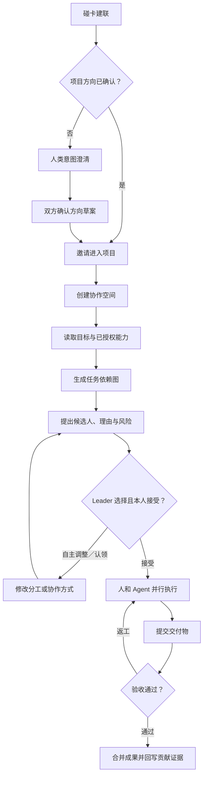

# COSPAN Space｜人类与 Agent 协作空间设计

> 本文承接 [06-产品定位与差异化.md](./06-产品定位与差异化.md) 与 [07-手机端功能结构与信息架构.md](./07-手机端功能结构与信息架构.md)。它回答：新认识的人或已有团队，怎样确认共同目标，由人和 Agent 一起完成项目。

> **当前范围（2026-09-06）：** 按[产品策略与阶段边界](./docs/2026-09-06-黑客松切入与人机协作产品策略.md)，黑客松是首个完整验证场景，持续协作与成果验收纳入当前目标；既有团队直入是规划中的另一入口。统一业务与数据底座服务小程序、手机 App 与电脑协作空间，硬件不是前置条件。具体代码缺口见[开发与验收清单](./docs/2026-09-06-产品上线开发与验收清单.md)。下文 96 小时及赛后 V1/V2 为早期路线，数据模型、治理机制和目标状态机不能直接当作已实现接口。

> **2026-08-29 历史基线：** 核心容器命名为 `COSPAN Space｜人机协作空间`，96 小时 MVP 先做项目启动舱。持续保留“不重做聊天、在线文档和代码仓库；不把固定模板描述为真实 Agent 编排”的原则；当前阶段不再止步于启动任务。

## 1. 结论先行

产品的长期方向可以从：

> **AI 帮用户找到值得认识的人**

延伸为：

> **帮助刚建立关系的人或已有创作团队看清目标、接受分工，并协调人和 Agent 一起把事情做完。**

发现与建联帮助形成合作关系，协作空间承接共同目标；既有团队可以直接进入目标确认与项目邀请。以下是目标流程，不表示跨工具同步和交付验收均已实现：

```text
发现与表达意愿
→ 线上双向确认建联（碰卡为可选增强）
→ 邀请进入具体项目
→ 建立协作空间
→ Agent 拆解目标并提出任务路由建议
→ 人确认承诺
→ 人在既有工具产出，Agent 在批准范围内执行
→ 提交有版本的成果引用，由人审阅、返工与确认交付
→ 保留关键变更、项目结果与经确认的贡献证据
```

这里的关键不是让多个模型“互相聊天”，也不是再做一套通用协作软件，而是建立一个受人控制的**协作编排与治理层**：知道目标是什么、谁愿意负责什么、哪些 Agent 可以在什么权限内并行执行、结果由谁审核、团队确认了哪个版本、失败后如何恢复，以及结果如何回到个人可携带的协作护照。

### 1.1 原有治理设计如何保留

| 处理方式 | 设计内容 | 在新边界中的位置 |
|---|---|---|
| V0 直接保留 | Agent 只有建议权、成员自主认领、人类最终确认、重大变更多人确认、历史可追溯 | COSPAN Space 的核心交互 |
| 保留数据模型 | 项目／方向发起归属、方向版本、Leader 任期、贡献证据 | 关键记录与赛后协作护照 |
| 当前优先接通／后续深化 | 已有 AgentRun 后端接入桌面；补成果验收；复杂 Orchestrator 与重新规划后续验证 | 不将后端简报能力等同完整多 Agent 编排 |
| 继续推迟 | 复杂权限编辑器、跨团队资源调度和完整通用任务生命周期 | 等真实团队证明需要后再做 |
| 明确不做 | 聊天、在线文档、会议、日历、网盘和通用项目管理 | 继续交给已有工具 |

### 1.2 核心原则：任务主权属于人

> **Agent 负责拆解、解释和建议；人负责选择、承诺和执行。**

Agent 可以根据能力证据、项目风险、可投入时间和任务依赖，建议“谁更适合负责哪一部分”，但这个建议不是任命。团队成员可以：

- 接受 Agent 的建议；
- 拒绝分配给自己的任务；
- 对分工提出改派或结对建议；
- 在权限允许时，主动认领自己感兴趣的开放任务；
- 将任务改为两人协作或人机协作；
- 建议拆小、合并或推迟某项任务；
- 即使缺少历史经验，也选择将某项工作作为成长型尝试。

系统必须把“有经验”和“想做”视为两类不同但都有效的信号。即时效率不是唯一目标；学习、探索、成就感和团队成员的自主性，同样是人类协作的一部分。

对应的系统不变量是：

> `AssignmentProposal` 不能直接写入正式负责人；只有具备任务分配权限的人作出选择，并由被指派者明确接受后，任务才能产生 `confirmed_owner`。

任务自主权不等于所有成员都拥有项目级调度权。普通成员有权决定自己是否承担任务、表达兴趣和提出调整；Leader／协调人负责确认全局分工和共享 Agent 的使用，任务负责人只在自己的任务范围内拥有执行与局部 Agent 调度权。

一旦任务已被成员接受并进入计划基线，Agent 也不能直接重新分配。它只能创建带有影响说明的 `ReplanProposal`；是否改派、何时生效以及如何处理下游排期，必须由有权限的人确认。

## 2. 产品定义与边界

### 2.1 什么是协作空间

`COSPAN Space` 是围绕一个明确项目目标组织人、Agent、执行与验收的持续协作空间，既能从新关系启动，也能承接已有团队。它的目标模型包含：

- 已确认加入的成员与 Agent；
- 项目目标、时间窗口和验收标准；
- 成员授权使用的能力信息、兴趣方向、成长目标与可投入时间；
- 初次及持续协作所需的任务、候选负责人、依赖、风险和完成标准；
- Agent 提出的路由建议及其理由；
- 人对任务的认领、接受、修改、转交、拒绝和验收记录；
- 关键变更、项目结果与经成员确认后可写回协作护照的贡献证据。

它优先解决黑客松中的三个问题：

1. 刚组好的队伍不知道谁负责什么；
2. 任务拆出来了，但承诺和完成标准不清楚；
3. 团队已经开始执行，却没有保留首次分工、关键转向和真实贡献的共同记录。

当前阶段还要验证：团队能否提交实际成果、完成审阅与返工，而不只维护一张“完成”状态表。现有任务 `DONE`、Agent 输出审阅和团队成果验收是三个不同事实。

### 2.2 什么不是协作空间

- 不是完整即时通信工具；
- 不是通用企业项目管理平台；
- 不是自动替团队做产品决策的“AI 队长”；
- 不是把每个人量化成公开能力分数的绩效系统；
- 不是要求所有项目文件和聊天记录都上传的平台；
- 不是只有使用实体卡片才能进入的硬件功能。

### 2.3 与飞书、GitHub 的交接边界

合拍维护目标、成员接受、协调状态、Agent 授权/运行和人类审阅记录；文档正文、代码、PR 与 CI 保留在原工具。项目采用外部任务系统时，应明确各字段的权威来源，避免两边重复维护同一任务状态。

先从有权限的项目/成果链接与版本引用做起，再验证只读连接器；外部写入必须另行设计授权、确认、冲突与恢复。当前个人 GitHub 资料摘要不能称为项目集成；手动链接不能称为双向同步。详见[策略文档的工具与数据边界](./docs/2026-09-06-黑客松切入与人机协作产品策略.md)。

## 3. 可以从多 Coding Agent 项目借鉴什么

以 Emdash 一类多 Coding Agent 工作台为例，其值得借鉴的并不是“多个模型厂商出现在同一个界面”，而是围绕任务建立隔离、调度、状态、审核和合并机制。

| 多 Coding Agent 工作台中的机制 | 本产品中的映射 | 产品价值 |
|---|---|---|
| Project Workspace | Collaboration Space | 每个项目拥有独立目标、成员、任务和上下文 |
| Git Worktree／独立分支 | 独立任务上下文 | 防止不同执行者互相覆盖；每项任务有清晰输入与输出 |
| Agent Provider | 人与 Agent 的统一能力注册表 | 路由时同时考虑人类能力、Agent 能力、权限和可用性 |
| Issue／任务导入 | 项目目标、角色缺口、急聘与 SOS | 将模糊需求转成可领取、可验收的工作项 |
| 多 Agent 并行执行 | 多职能成员与 Agent 并行执行 | 让设计、前端、硬件、调研和代码任务同步推进 |
| Lifecycle Hook | 活动事件与任务状态变化 | 自动发现开始、阻塞、提交、超时和失败 |
| Diff／CI Review | 交付物审核 | 人在接受成果前能看见变化、证据和检查结果 |
| Merge | 接受成果并写入项目主空间 | 只有经过验收的结果才成为团队正式成果 |
| Local-first／可恢复会话 | 用户控制资料与可恢复上下文 | 减少平台锁定，同时避免重复向 Agent 解释项目背景 |

### 3.1 最值得借鉴的六条底层原则

1. **任务隔离：** 每项任务都有自己的输入、上下文、产出和负责人；
2. **建议式路由：** 根据能力、兴趣、成长意愿和约束提出候选方案，由人最终决定；
3. **事件驱动：** 由任务状态、阻塞和新交付物触发下一步，而非让 Agent 持续无目的运行；
4. **审核后合并：** Agent 的结果是候选成果，不是未经确认的项目事实；
5. **全过程可追溯：** 保存谁提出、谁接受、谁执行、谁验收以及基于什么输入；
6. **失败可恢复：** Agent 超时、成员拒绝或任务失败时，可以重新路由而不丢失项目上下文。

### 3.2 不能直接照搬的部分

- Git 代码天然有 Diff 和 Merge，设计决策、用户访谈和硬件焊接没有同样标准化的合并方式；
- Agent 可以被系统立即调度，但人类有时间、意愿、关系和承诺边界，不能被静默派活；
- 模型的能力声明相对稳定，人的“会做”不等于“此刻愿意做”或“本场有时间做”；
- 人的“没做过”也不等于“不能选择做”；系统可以提示风险，但不能仅凭履历剥夺尝试机会；
- 代码任务容易自动检查，而产品方向、视觉质量和现场体验仍需要人做最终判断；
- 多 Agent 工具面向仓库，本产品面向跨职能协作，交付物可能是代码、图片、文档、实物、链接或一次现场操作。

## 4. 人与 Agent 的统一任务协议

为了让人和 Agent 出现在同一个工作流里，任务不能只写一句“把后端做一下”。每个 `WorkItem` 至少包含以下字段：

| 字段 | 含义 |
|---|---|
| `objective` | 这项任务要解决什么问题 |
| `executor_type` | `HUMAN`、`AGENT` 或 `HYBRID` |
| `candidate_owners` | Agent 给出的一个或多个候选负责人 |
| `routing_reason` | 为什么推荐给这个人或 Agent |
| `interest_signals` | 谁主动表示想做、愿意协作或希望借此学习 |
| `assignment_mode` | `EFFICIENCY`、`STRETCH`、`PAIR` 或 `OPEN_CLAIM` |
| `confirmed_owner` | 经有权限的角色选择且本人接受后的正式负责人；建议阶段为空 |
| `inputs` | 已授权使用的资料、文件、链接和上游结果 |
| `expected_artifact` | 预期交付物，如代码、文档、设计稿、硬件测试结果 |
| `dependencies` | 开始前必须完成的其他任务或决策 |
| `acceptance_criteria` | 什么条件下才算完成 |
| `due_at` | 截止时间或时间窗口 |
| `permissions` | 执行者可以读取、生成或修改什么 |
| `status` | 当前任务状态 |

### 4.1 三种执行类型

| 类型 | 适用任务 | 示例 |
|---|---|---|
| `HUMAN` | 需要现场操作、关系判断、创意裁决或最终承诺 | 焊接设备、访谈用户、确定路演叙事 |
| `AGENT` | 输入明确、风险较低、结果可检查的数字任务 | 整理资料、生成接口草案、跑测试、汇总反馈 |
| `HYBRID` | Agent 可先产出草案，但必须由人补充或验收 | AI 拆需求＋产品负责人确认；Agent 写代码＋开发者 Review |

### 4.2 任务状态

```text
待确认 → 已接受 → 进行中 → 待验收 → 已完成
                     ↓          ↓
                    阻塞       返工
```

- `待确认`：Agent 已提出候选方案，团队尚未选择，或候选负责人尚未承诺；
- `已接受`：人主动接受，或具备权限的 Agent 任务被明确批准；
- `进行中`：执行已经开始；
- `阻塞`：缺少输入、权限、设备、决策或上游交付物；
- `待验收`：已有候选交付物，尚未成为项目正式成果；
- `返工`：验收不通过，保留原因并回到执行；
- `已完成`：成果通过验收并合并到项目主空间。

## 5. Agent 路由机制

### 5.1 路由输入

Agent 只能基于协作空间内已授权、已确认的信息提出建议：

- 项目目标、优先级、截止时间与当前风险；
- 成员声明并确认的能力、项目证据和可投入时间；
- 成员当前“想做／愿意做／不想做”的偏好，以及希望尝试的新方向；
- Agent 已注册的工具、能力、成本、时延和权限；
- 任务所需能力、依赖、交付物与验收标准；
- 当前工作量、已接受任务和阻塞状态。

### 5.2 推荐顺序

路由不追求抽象的“匹配度”，而是依次回答：

1. 是否存在安全、权限或外部资质等不能突破的硬约束；
2. 谁已有相关经验，谁对这项任务有明确兴趣或成长意愿；
3. 各候选人当前是否有时间和容量；
4. 任务更适合独立完成、结对完成还是人机协作；
5. 如果由低经验成员尝试，怎样拆小范围、增加检查点并控制项目风险；
6. 失败后是否能安全撤销、重试或转交，以及由谁验收。

对用户展示的是“推荐理由＋待确认问题”，而不是公开的人才评分。例如：

> 效率优先方案：建议由周闻负责接口联调，因为他已负责后端数据模型；Codex Agent 可先生成契约测试。成长型方案：林澈表示想尝试后端联调，可由林澈主做、周闻担任 Review，并在第一个接口跑通后设置检查点。最终分工由团队选择，两位成员分别确认。

### 5.3 成长型任务：允许没有经验的人主动尝试

当成员明确表达“我特别想做这部分”时，系统不应因为缺少历史经验而直接隐藏或否决其申请。Agent 应从“派活者”转为“辅助者”：

1. 明确说明经验缺口和对关键路径的影响；
2. 建议把任务拆成更小、可验证、可回退的阶段；
3. 推荐一名有经验的成员或 Agent 作为协作者／Reviewer；
4. 为过程中间设置检查点，而不是等到截止前才验收；
5. 提供参考资料、操作步骤、代码脚手架或测试方法；
6. 若成员、Leader／协调人仍确认该方案，系统尊重选择并记录正式分工。

例如：Agent 根据履历建议后端成员负责 NFC 建联接口，但一名没有后端经验的产品成员非常想尝试。团队可以把该任务切成“完成一个模拟请求＋跑通契约测试”，由产品成员负责、后端成员 Review、Coding Agent 提供脚手架。系统展示时间风险和检查点，但不能以“历史经验不足”为由阻止认领。

只有涉及人身安全、生产数据、付款、公开发布、法定资质或不可逆外部动作时，平台才可以通过权限规则限制执行，而不能仅以“推荐分较低”限制成员选择。

### 5.4 自动化权限分级

| 等级 | Agent 可以做什么 | 是否需要当次确认 |
|---|---|---|
| L0 建议 | 拆任务、推荐负责人、提示依赖与风险 | 不修改项目数据，可直接生成建议 |
| L1 草稿 | 生成文档、代码草案或设计说明 | 交付前必须由人验收 |
| L2 可逆执行 | 在限定工作区运行测试、创建分支或整理文件 | 首次授权；所有变化可审查、可撤销 |
| L3 外部动作 | 部署、发消息、付款、公开发布或修改生产数据 | 每次明确确认，96 小时版本不做 |

## 6. Leader 选择与权限治理

> **当前实现状态（2026-08-29）：** 薄闭环基线已经进入运行代码：后端具有 `Project`、角色缺口、`ProjectMembership`（`ORIGINATOR／LEADER／MEMBER`）、`StarterPack`、三项启动任务、成员本人认领、全员方案确认、COSPAN Space 聚合视图和项目 Activity。尚未实现 `LeadershipTerm` 选举／交接、方向谱系、重大变更多人确认、历史归属更正和外部工具双向同步；因此当前 `ORIGINATOR` 是启动阶段的治理占位，不应被解释为永久 Leader。

### 6.1 先拆开六种容易混淆的身份

| 身份 | 核心含义 | 不自动拥有的权力 |
|---|---|---|
| `ProjectOriginator` | 提出项目最初 0→1 Idea，并由团队确认其来源的人；可以是多人 | 不是永久 Leader，也不自动拥有后来所有方向的发起归属 |
| `DirectionOriginator` | 首先提出某个被团队采用的具体方向版本的人；每个方向独立记录 | 不因为提出方向就自动获得永久调度权或全部成果归属 |
| `SpaceCreator` | 谁创建了这个协作空间，是一条不可变的来源记录 | 不等于永久 Leader，也不等于可以支配所有成员 |
| `SpaceOwner／Admin` | 管理成员访问、角色、集成、预算上限、归档与安全设置 | 不自动拥有产品方向和具体任务的最终判断权 |
| `TeamLeader／Coordinator` | 在一个明确方向／阶段内维护目标、优先级、依赖和全局分工，批准共享 Agent 调度 | 不是永久身份；不能替成员接受任务，也不能越权公开资料 |
| `TaskOwner` | 对一项已接受任务的执行、局部协作与交付负责 | 不能改动其他任务，不能调用超出任务范围的 Agent 或数据 |

在三人黑客松中，这些身份可以由同一个人兼任，但数据模型和权限必须分开。尤其不能用“谁创建了空间”“谁最初提出 Idea”直接推导出永久 Leader，也不能因为团队转向新方向，就覆盖最初发起人的历史归属。

### 6.2 不使用单一“权重占比”，而是维护三本账

0→1 Idea 是一项重要贡献，但不宜直接做成一个综合百分比。一个数字会混淆历史归属、当前权限和实际交付。由于黑客松不涉及投资与股权，本产品只维护三类事实：

| 账本 | 回答的问题 | 是否随时间变化 |
|---|---|---|
| **发起归属账本** | 谁完成了最初项目／某个方向的 0→1 提出 | 原则上不可变，只能追加更正或共同发起人 |
| **治理任期账本** | 当前方向和阶段由谁担任 Leader | 可经团队确认交接，有明确开始／结束时间 |
| **实际贡献账本** | 谁接受并完成了哪些任务、决策和交付物 | 持续累积，以确认过的证据为准 |

因此，项目界面应展示“最初项目发起人”“当前方向发起人”“本阶段 Leader”和“实际贡献记录”，而不是展示一个笼统的个人权重排行。

发起归属是一种永久的 Provenance，不会因为发起人后续参与度降低而消失；Leader 是一段可交接的 Governance Term，会受到当前参与度和团队确认的约束。两者同时成立，并不冲突。

### 6.3 方向 A 转向完全独立的方向 B

每次被团队正式采用的方向都应保存为独立 `DirectionVersion`，至少包含：目标用户、核心问题、预期结果、方向描述、提出者、共同提出者、确认成员、确认时间和与上一方向的关系。

系统需要区分两种变化：

- **方向迭代／Pivot：** 核心问题或目标仍然连续，只是方案和实现路径改变；B 可以作为 A 的下一版本并标记 `supersedes=A`；
- **独立方向／Fork：** 目标用户、核心问题或预期结果已经实质变化；B 应创建独立方向分支，记录 `forked_from=A`，不能把 A 原地改名成 B。

对于“最初由甲提出方向 A，团队后来一致决定推进完全独立的方向 B，方向 B 由乙首先提出”的案例：

1. 甲永久保留 `ProjectOriginator` 和 `Direction A Originator` 归属；
2. 乙被记录为 `Direction B Originator`，如果是多人共同形成，则记录共同发起；
3. A 作为历史版本／分支保留，不能由 Agent 或 Leader 覆盖；
4. B 成为当前 Active Direction 前，属于 C3 重大变更；2–5 人团队默认需要全体有效成员确认；
5. 如果团队无法一致同意覆盖当前方向，则创建 B Fork，成员分别选择继续 A 或加入 B，而不是抹掉任何一方；
6. B 的方向发起人可以自荐或被提名为 B 阶段 Leader，但不能仅凭发起归属获得自动优先权；
7. A 发起人不会自动获得 B 的方向发起归属，B 发起人也不会取代 A 的最初项目发起归属。

Agent 可以根据会议记录提出“可能的方向发起人／共同发起人”候选，但不得自行确权。`OriginAttribution` 必须由相关成员确认；确认后属于受保护历史，不能被普通编辑或 Agent 重写。

### 6.4 Leader 如何产生与持续

推荐采用“发起人负责启动＋团队授予维护权”的机制：

1. 在只有发起人一人时，由其担任 `BootstrapCoordinator`，仅用于邀请成员、补充初始上下文和生成第一版草案；
2. 第一批成员入队、首个方向基线准备确认时，团队显式授予一名 `Coordinator／Maintainer` 当前阶段的维护权；
3. 项目发起人和方向发起人都可以自荐或被提名，但发起归属本身不自动产生优先级；
4. 候选人必须明确愿意承担，并说明本阶段可投入时间、技术／交付责任和协调范围；
5. 每次重大方向变更、Fork 成为主方向或关键里程碑结束时，创建新的 `LeadershipTerm` 并复核维护权；
6. Agent 可以根据方向上下文、协调意愿、可投入时间、已承担工作和解除阻塞能力给出候选理由，但不能投票或任命；
7. Leader 参与度下降时，系统先提示风险和建议交接；新 Leader 接受且团队确认后生效，任何人的历史发起与贡献记录都不改变。

Leader／Maintainer 的推荐不应依据“综合能力最高”“项目最多”、社交关系或历史贡献总量，而应依据当前是否理解方向、是否愿意协调、是否能稳定投入、是否承担关键交付责任，以及是否能够促成决策和解除阻塞。

“参与度”不做成公开排名，也不通过一次活跃度下降自动罢免。可用于触发复核的信号包括：是否接受本阶段职责、是否回应关键决策、是否持续处理阻塞，以及是否在约定时间窗口内保持可联系。系统只提示“建议复核／交接”，最终仍由人决定。

长期可以支持三种治理模板：

- **单协调人：** 适合 2–5 人短期项目，是黑客松默认模式；
- **共同协调人：** 两人分别负责方向与执行，但必须明确各自权限；
- **扁平团队：** 不设长期 Leader，只为每个工作流指定负责人；仍保留一名 Admin 处理权限和安全事务。

该机制属于赛后 V1：项目发起人在单人阶段担任 `BootstrapCoordinator`，首批成员入队后再确认一名 Coordinator，界面始终独立展示发起归属。96 小时主线不实现任期选举、Coordinator 确权或方向 Fork 交互。

### 6.5 权限矩阵

| 动作 | Owner／Admin | Leader／Coordinator | Task Owner | Member | Reviewer／Guest | Agent |
|---|---:|---:|---:|---:|---:|---:|
| 管理空间访问与角色 | 允许 | 可邀请，移除需规则确认 | 否 | 否 | 否 | 否 |
| 设置项目目标和优先级 | 可协助 | 允许 | 可提议 | 可提议 | 可评论 | 只建议 |
| 创建／拆分／合并任务 | 可协助 | 允许 | 仅自己的任务内 | 可提议 | 否 | 只生成草案 |
| 确认任务正式负责人 | 可配置规则 | 允许，但需被指派者接受 | 仅添加本任务协作者 | 只能认领开放任务／提出申请 | 否 | 否 |
| 接受或拒绝自己的任务 | 仅本人 | 仅本人 | 仅本人 | 仅本人 | 不适用 | 由授权人批准 |
| 调度共享 Agent | 配置预算和上限 | 允许在项目范围内批准 | 仅限自己的任务和已授权工具 | 只能提出调用申请 | 否 | 不得自我扩权 |
| 修改已确认计划基线 | 可按规则参与 | 发起变更单 | 仅为自己的任务提出申请 | 可提出申请 | 可评论 | 只能生成变更建议 |
| 删除／覆盖历史存档 | 只能发起多人审批 | 必须参与多人审批 | 仅能对本人记录提出申请 | 仅能对本人记录提出申请 | 否 | 永不允许直接执行 |
| 查看项目私有资料 | 按空间授权 | 按空间授权 | 按任务范围 | 按成员范围 | 仅明确分享内容 | 仅当前任务最小上下文 |
| 验收交付物 | 可按规则参与 | 项目级成果 | 本任务或指定 Reviewer | 仅被指定时 | 仅被指定时 | 可跑检查，不能最终批准 |
| 发布、部署或付款 | 管理权限不等于业务确认 | 发起审批 | 可申请 | 可申请 | 否 | L3 每次需人明确确认 |

两个边界必须守住：

1. **Leader 可以确认把任务分给谁，但不能替对方点击“接受”；**
2. **成员可以拒绝、申请和自我认领，但不能修改别人的任务或消耗共享 Agent 预算。**

### 6.6 信任模型：善意协作、受控变更

黑客松空间默认不是按照“团队里一定存在攻击者”设计。成员通常认识、目标一致，也愿意彼此配合。真正需要防范的是：

- 成员误操作或对变更影响理解不一致；
- 两个人同时修改任务，导致负责人、依赖和排期互相覆盖；
- Agent 根据局部信息重新规划，却打乱已经确认的关键路径；
- 自动化以极快速度批量修改大量任务或产出；
- 已验收成果、Git／版本记录、贡献证据或历史存档被覆盖、隐藏或删除。

因此，治理原则不是“所有操作都审批”，而是：

> **低影响动作保持顺畅；跨成员、跨任务、不可逆或改写历史的动作自动升级。**

所有 Agent 规划都先进入 `DraftPlan`。团队确认后形成不可被 Agent 直接改写的 `PlanBaseline`。此后 Agent 只能生成带 Diff 的 `ChangeRequest／ReplanProposal`，由权限系统判断需要谁确认；Agent 本身没有投票权，也不能成为多人审批中的一个“人”。

### 6.7 变更分级与具体阈值

| 等级 | 判定条件 | 典型动作 | 生效条件 |
|---|---|---|---|
| C0 草稿 | 未进入正式空间数据，不影响任何成员 | Agent 生成任务草案、个人调整排序 | 无需审批，可随时丢弃 |
| C1 局部可逆 | 只影响一名成员自己的一项任务；不改变负责人、关键依赖和历史 | 更新自己的进度、增加备注、提交新版本、在任务沙盒运行 Agent | Task Owner 直接执行，完整记日志 |
| C2 协同变更 | 修改一项已接受任务的负责人、截止时间、验收标准或依赖；或影响另一名成员 | 任务改派、结对、插入前置任务、Agent 建议重新排期 | Leader 发起／批准＋当前负责人释放＋新负责人接受；受影响下游负责人确认 |
| C3 重大变更 | 命中任一重大阈值 | 批量重排、修改项目目标／里程碑、改变角色权限、提高共享 Agent 预算 | 至少 2 名不同的人确认，并达到有效成员简单多数；所有直接受影响负责人必须包含在确认者中 |
| C4 受保护历史／不可逆 | 覆盖或永久删除已验收成果、决策记录、贡献证据、事件日志或整个空间 | 硬删除存档、批量清空、覆盖已发布基线 | 默认禁止；只允许走强化多人审批、冷静期、快照备份和再次认证 |

任一条件成立，即判定为 C3“重大变更”：

1. 影响两名及以上成员已经接受的职责；
2. 影响的已接受任务数达到 `max(2, ceil(活跃任务数 × 20%))`；
3. 改变项目目标、最终里程碑、提交截止时间或关键路径；
4. 修改 Leader、Admin、成员访问范围或 Agent 权限边界；
5. 让共享 Agent 预算超过团队预先授权上限；
6. 将已验收成果从项目主视图撤下，或改变其对外可见状态。

其中，“将当前项目从一个方向切换到完全独立的新方向”采用比普通 C3 更严格的规则：2–5 人团队需要全体有效成员确认；无法一致时默认 Fork，不允许以简单多数覆盖旧方向及其发起归属。

这里使用“满足任一条即升级”，不计算一个不透明的综合风险分。团队人数和任务量很小时，`至少 2 项任务／2 名成员` 的下限可以避免一次普通局部修改被误判成集体审批；团队扩大后，20% 阈值又能阻止批量自动变更。

### 6.8 历史存档的不可变与多人确认

对历史记录，最安全的产品设计不是提高“编辑门槛”，而是**默认禁止原地改写**：

- 已验收的 `Artifact` 产生新版本，旧版本继续保留；
- 已确认的任务分工通过新 `AssignmentDecision` 修正，不覆盖旧决定；
- `ActivityEvent` 采用追加写入，不能由成员或 Agent 修改；
- 错误记录使用“更正说明＋新版本”，而不是删除原记录；
- 普通“删除”实际执行归档／软删除，支持恢复并保留操作人和时间；
- Agent 永远没有 `history.overwrite`、`history.hard_delete` 权限，只能创建删除申请。
- `ProjectOriginator`、`DirectionOriginator` 和方向谱系属于受保护历史；更正必须保留旧记录，并由被增加、移除或改变归属的相关成员确认。

如果确实需要永久删除整个空间或共享历史存档：

1. 系统先展示精确 Diff：将删除哪些任务、版本、贡献记录和成员可见内容；
2. 自动创建加密快照或可恢复备份，并生成恢复截止时间；
3. 审批必须来自不同自然人，同一个人兼任 Owner 和 Leader 只能算一票；
4. 对 2–5 人黑客松团队，默认要求所有仍在空间内的有效成员一致确认；
5. 对更大团队，要求不少于三分之二有效成员，并且必须包含 Owner／Admin、Leader 和所有记录直接归属者；
6. 设置冷静期，期间任何一名审批者都可以撤回；冷静期结束后再次认证才执行；
7. 因隐私或法律原因删除个人数据时，优先只删除该用户的数据并对共享记录做匿名化，不要求其他成员否决其法定权利。

多人阈值中的“有效成员”只计算已加入、未退出、未被停用的自然人；Agent、Guest、待加入用户均不计入法定人数。

### 6.9 权限计算方式

不能只靠一个 `role=leader` 字段判断所有权限。有效权限应同时满足：

```text
有效权限
= 角色基础权限
∩ 当前对象范围（Space／WorkItem／Artifact）
∩ 用户明确授权的数据范围
∩ 动作风险等级与预算限制
```

例如，任务负责人可以让 Coding Agent 修改自己任务对应的测试分支，但不能读取另一个私密用户访谈任务，也不能调用团队预算部署生产环境。Agent 继承的是一次有范围、有时效的 `PermissionGrant`，并且不得把权限继续转授给其他 Agent。

### 6.10 赛后 V1 的最小权限实现

只保留三种用户可见角色：

- **Coordinator／Maintainer：** 团队在首个基线前确认，负责确认三项任务的候选负责人和批准共享 Agent 草稿；
- **成员：** 接受／拒绝自己的任务、对开放任务点击“我想做”、提出调整；
- **Agent：** 生成建议和草稿，不直接修改正式分工。

空间创建者在当前后端记录为 `ORIGINATOR`，用于启动阶段邀请与项目治理；演示重置由独立访问密钥控制，不属于项目 Owner 权限。当前代码已经证明“Agent 建议不会自动写入任务负责人”和“任务由成员本人认领”；下一阶段仍需证明重新分工只生成待确认变更，以及“删除历史存档”只进入多人确认流程、不执行真实硬删除。

## 7. 端到端协作流程



这条流程中有四个不同层次的同意，不能合并为一次授权：

1. **碰卡同意建联：** 允许建立真实相遇连接；
2. **方向同意：** 允许把人类共同写下的方向草案确认为项目方向，但不自动创建团队或任务；
3. **入队同意：** 允许加入一个具体项目空间；
4. **任务同意：** 团队可以选择分工，但被指派者仍需确认是否承担；对于 Agent，则由人确认其可使用的资料、工具和执行范围。

因此，“Leader 选了谁”和“这个人愿不愿意承担”不能混为一个动作。成员可以申请认领，也可以拒绝 Leader 或 Agent 的建议；任务归属必须以被指派者的明确接受为最终条件。

## 8. 核心领域对象

| 对象 | 关键内容 | 说明 |
|---|---|---|
| `CollaborationSpace` | 项目、成员、目标、截止时间、权限 | 协作的边界与主上下文 |
| `ProjectOrigin` | 最初 Idea、发起人／共同发起人、确认记录、时间 | 永久保存项目 0→1 来源，不等同于永久 Leader |
| `DirectionVersion` | 方向、用户、问题、结果、状态、父方向／被替代方向 | 用版本或 Fork 保存 A→B 的演进，不原地覆盖 |
| `DirectionDraft` | 目标用户、核心问题、预期结果、提交者、成员确认状态 | 意图澄清形成的未确认草案；不产生团队、Leader 或任务 |
| `OriginAttribution` | project／direction、归属成员、类型、确认记录 | 区分项目发起与方向发起，并支持共同发起 |
| `DirectionTransition` | from、to、pivot／fork、提议者、确认者、时间 | 记录团队为什么以及如何改变方向 |
| `SpaceMembership` | 成员、角色、加入状态、对象范围 | 角色权限的基础，不把所有成员视为同权 |
| `LeadershipTerm` | Coordinator／Maintainer、direction／phase 范围、开始／结束、产生方式、交接记录 | 维护权显式授予并随阶段复核，不从贡献自动产生 |
| `PermissionGrant` | actor、动作、对象范围、数据范围、风险等级、到期时间 | 约束人和 Agent 实际可执行的操作 |
| `PlanBaseline` | 已确认的任务、负责人、依赖、排期和版本 | Agent 只能读取和提出 Diff，不能原地覆盖 |
| `ChangeRequest` | 变更内容、影响级别、Diff、回滚方案、审批状态 | 所有跨范围变更的统一入口 |
| `ApprovalRecord` | 自然人、角色、决定、时间、撤回状态 | Agent 不计入人数；一人兼多角色仍只算一票 |
| `RecordVersion／Tombstone` | 历史版本、软删除标记、恢复期限 | 保持历史可追溯并避免误删 |
| `Participant` | 用户或 Agent、角色、可用状态、兴趣与成长目标 | 人和 Agent 共用参与者抽象，但人的偏好和自主权单独建模 |
| `CapabilityClaim` | 能力、证据、来源、确认状态、可见范围 | 不把自我声明自动当作事实 |
| `AssignmentPreference` | 想做、愿意协作、希望学习、暂不接受 | 表达当下意愿，不把历史履历当作唯一依据 |
| `WorkItem` | 目标、执行类型、负责人、依赖、验收标准、状态 | 最小可路由工作单元 |
| `DependencyEdge` | 上游、下游、阻塞关系 | 支持并行与关键路径判断 |
| `AssignmentProposal` | 候选对象、效率／成长方案、理由、风险、状态 | 只是一份可编辑建议，不产生正式负责人 |
| `AssignmentDecision` | 有权限角色的选择、被指派者确认、协作方式、时间 | 只有该对象成立后才能写入正式负责人 |
| `Artifact` | 类型、链接／文件、创建者、版本、权限 | 人和 Agent 的交付物统一入口 |
| `ReviewDecision` | 审核者、通过／返工、理由、时间 | 决定成果是否进入项目主空间 |
| `ActivityEvent` | actor、动作、对象、时间、前后状态 | 用于追溯、恢复和产品分析 |
| `ContributionEvidence` | 任务、产出、确认方、公开范围 | 经确认后才能写回个人协作护照 |

贡献事件建议使用 `ORIGIN_PROPOSED`、`DIRECTION_ADOPTED`、`TASK_ACCEPTED`、`ARTIFACT_SUBMITTED`、`CO_AUTHORED`、`REVIEWED`、`DECISION_ACCEPTED` 和 `BLOCKER_RESOLVED`。每条记录关联具体对象、版本／Hash、证据、共同贡献者与确认人；只展示事实，不累计成个人总分。

### 8.1 最小权限规则

- 用户加入协作空间后，只能看到该空间明确共享的内容；
- Agent 采用最小权限，只读取完成任务必需的上下文；
- Agent 不得原地覆盖 `PlanBaseline`、已验收成果或历史事件，只能提交变更申请；
- Agent 不得自行确认或改写项目／方向发起归属；
- 活动主办方只能看到用户对该单场活动明确授权的快照；
- 主办方不能默认读取团队私有任务、交付物或跨活动协作记录；
- 退出项目、撤销授权或活动结束后，系统按既定规则收回访问权限；
- 贡献记录可由用户保存为长期协作护照，但公开字段和范围仍由本人决定。

## 9. 双端呈现建议

`COSPAN Space` 属于手机底部导航的“协作”模块；“连接”仍作为独立一级入口，保存跨项目、跨活动的人际关系。启动舱采用同一数据、两种终端形态：

### 9.1 手机：现场主入口与伴随端

手机首屏像一张“项目登机牌”，只回答四个问题：

1. 团队正在启动还是已经执行；
2. 距离截止还有多久；
3. 下一项需要我确认或认领的事情是什么；
4. 最近发生了什么关键变化。

```text
协作
└── COSPAN Space
    ├── 启动：目标、成员、三步进度、下一步、最近动态
    ├── 分工：Agent 建议、我来负责、人类确认、我的启动任务
    └── 动态：成员加入、方案版本、重大变更确认、项目 SOS
```

手机不展示复杂权限矩阵、完整看板、文档、聊天、文件树或长期任务后台。

### 9.2 电脑：项目启动舱主工作台

宽屏只在启动与关键治理阶段使用，采用三栏结构：

1. 成员、来源角色与必要权限；
2. Agent 分工提案、主动认领与首次任务；
3. 项目发起、版本记录、重大变更与贡献依据。

确认完成后，团队进入已有工具执行。COSPAN 不要求成员在两个平台重复维护日常状态；只有关键变化和项目结果需要回写。

界面应延续手机端的黑白灰＋少量蓝色：蓝色只用于当前主行动、待确认和选中状态；不要用大面积颜色表达“AI 正在工作”，也不要依赖颜色区分任务状态。

## 10. COSPAN Space 分阶段演示范围

### 10.1 基础建联闭环稳定后的一条薄闭环

1. 两名用户通过碰卡建立真实相遇连接；
2. 若项目方向未定，双方分别表达意图、共同填写方向草案并分别确认；Agent 只整理重合点和待确认问题；
3. 方向确认后，一方创建项目并发出邀请，另一方确认加入；
4. 系统创建轻量 `COSPAN Space`；
5. 界面分别显示“项目发起人”和“当前 Coordinator”；发起人在单人阶段负责启动，成员入队后共同确认维护人；
6. Agent 读取项目目标和两人的已授权能力；
7. 生成角色覆盖、一个风险和三个任务；
8. 每个任务显示执行类型、候选负责人、推荐理由、风险和完成标准；
9. 只有协调人可以确认正式候选负责人和调用共享 Agent；
10. 其中一名成员对一个“非最优推荐”的任务表达“我想做”；
11. 协调人批准改派，并选择独立、结对或 Agent 辅助方式；
12. Agent 再次建议改派时，只产生一张带影响范围的待确认变更卡，不直接改变现有分工；
13. 被指派者明确接受后，任务才进入“进行中”；
14. 生成飞书／GitHub 同步包，说明执行离开启动舱；
15. 将一个项目结果写为私有协作记录；
16. 演示历史存档删除需要多名成员确认，但不执行真实硬删除。

后续演示仍应沿用现有 `AI 团队启动包` 作为协作空间的最小版本，不另做一套完整项目管理页面。

> **代码覆盖说明：** 当前后端已跑通建联、邀请确认、Membership、Room 创建、固定三任务启动包、本人认领、全员确认、Activity 与 SOS；手机和宽屏 Demo 已有对应启动舱视图。步骤 4、8–11、13–15 中涉及 Coordinator 选举、改派审批、跨工具真实写入和重大变更多人确认的部分仍是产品规则与界面表达，尚未伪装成已实现能力。

### 10.2 该薄闭环仍明确不做

- 不开发通用多模型运行引擎；
- 不真正同时调度多个外部 Coding Agent；
- 不做 Agent 自主循环、自动部署或外部消息发送；
- 不做复杂聊天、甘特图、工时或绩效系统；
- 不做公开贡献评分或成员排名；
- 不做跨团队资源调度和策展方管理中台；
- 不做复杂角色编辑器、完整投票和共同 Leader 权限冲突处理；
- 不实现完整方向版本树；Demo 只预留“方向来源”展示和数据结构；
- 不实现真实历史硬删除，只做归档和多人确认界面；
- 不把 Agent 成功执行作为主演示的单点依赖。

如果现场 LLM 不可用，必须降级为规则生成的角色建议与固定三任务模板，完整闭环仍可演示。

## 11. 赛后演进路线

| 阶段 | 产品能力 | 验证目标 |
|---|---|---|
| V0：协作启动包 | 发起归属＋Bootstrap Coordinator、三个任务、确认维护人、本人接受、结果回写 | 建联后是否更快开始工作，同时把贡献记录与治理权限分开 |
| V1：关键治理层 | 方向来源、关键阻塞、重大变更、结果回写 | 团队是否愿意在启动和关键节点回到 COSPAN，而非维护第二套任务系统 |
| V1.5：方向谱系 | Direction Version、Pivot／Fork、方向发起归属和 Leadership Term | 方向转型时能否同时保留旧发起归属与新方向贡献 |
| V2：人机协作编排 | 接入 Room Orchestrator 与至少一个真实 Coding／Research Agent，支持 AgentRun、权限、并行、审核和失败恢复 | Agent 是否降低实际执行时间，而非只增加演示感 |
| V3：跨工具协作 | GitHub、飞书等结果引用与事件同步 | 产品能否成为已有工具之上的启动与治理层 |
| V4：可携带协作网络 | 用户授权保存跨项目贡献证据和重复合作记录 | 真实结果能否改善下一次组队与任务路由 |

## 12. 成功指标与证伪条件

| 假设 | 指标 | 失败信号 |
|---|---|---|
| 启动包能减少组队后的混乱 | 入队→接受首个任务的时间和转化率 | 用户仍回到群聊口头分工，不打开任务 |
| 路由理由能提高接受率 | 建议任务的接受、修改、转交和拒绝比例 | 用户普遍认为建议与能力或时间不符 |
| 自主认领能兼顾效率与成长 | “我想做”使用率、成长型任务完成率、成员满意度 | 团队只机械接受建议，或成长型任务频繁拖垮关键路径 |
| 分级权限能避免协作冲突 | 未授权改派、跨任务 Agent 调用和预算越权次数必须为 0 | 成员不理解自己为何不能操作，或频繁请求 Leader 造成阻塞 |
| 变更分级能保护已确认计划 | Agent 直接改写基线次数必须为 0；C2／C3 变更确认完成率 | 所有修改都要投票造成阻塞，或重大改动仍能绕过确认 |
| 历史不可变机制能保护协作证据 | 已验收记录被原地覆盖次数必须为 0；误归档恢复成功率 | 用户无法纠正错误，或软删除仍导致资料不可恢复 |
| 发起归属和 Leader 分离能减少冲突 | 发起归属争议率、Leader 交接完成率、方向变更后的认可度 | 用户把发起人标签理解为永久控制权，或转型后新方向发起者不可见 |
| Agent 能真正节省执行时间 | Agent 交付物通过率、平均返工次数、节省时间自评 | 反复修正 Agent 结果比自己完成更慢 |
| 审核与合并机制能提高信任 | 未经确认写入正式成果的次数必须为 0 | 用户不清楚哪些是草稿、哪些是正式成果 |
| 贡献证据值得跨活动保留 | 项目后确认并保存记录的用户比例 | 用户认为记录无价值，活动结束后全部放弃 |

## 13. 对外表达

### 13.1 一句话版本

> 我们不只用 AI 帮你找到队友；碰卡建联之后，系统把项目发起、实际交付和 Review 记录到具体成果上，由团队显式授予当前 Coordinator 维护权限，再通过人类确认把 Agent 建议合入受保护协作基线。

### 13.2 与现有工具的关系

> 飞书、GitHub 等已有工具负责承载具体沟通与产出；COSPAN 负责把“刚认识的一群人”变成完成首次分工、能够立刻开工的团队，并沉淀关键变化与真实贡献。

### 13.3 路演时必须避免的说法

- 不说“Agent 自动管理所有人”；应说“Agent 提出可解释的任务路由建议，人确认承诺”；
- 不说“系统把最合适的人分配到任务”；应说“系统提供候选方案，人可以按兴趣、成长目标和实际情况重新分工”；
- 不说“所有成员都能调度 Agent”；应说“Leader 管理项目级调度，任务负责人只在自己任务和授权范围内使用 Agent”；
- 不说“Agent 可以动态重新安排团队”；应说“Agent 只能提交带 Diff 的重排建议，已确认计划必须由受影响的人批准后才改变”；
- 不说“发起贡献带来 Leader 优先权”；应说“发起归属永久记录，Coordinator／Maintainer 权限根据当前交付责任由团队显式授予”；
- 不说“团队转向后原 Idea 被替换”；应说“方向以版本或 Fork 演进，每个方向分别记录发起者和确认过程”；
- 不说“已经拥有多 Agent 技术壁垒”；应说“先验证人机协作控制面，赛后再接入真实执行 Agent”；
- 不说“取代项目管理工具”；应说“承接从建联到开工的第一公里，并可连接既有工具”；
- 不说“按能力给人打分”；应说“根据当前目标、证据、权限和可投入时间解释推荐”。

## 参考

- Emdash：<https://github.com/generalaction/emdash>，用于理解多 Coding Agent 的任务隔离、并行执行、生命周期、审核与合并机制；本文没有假设其产品直接覆盖人类跨职能协作。

## 附录 A：图表规划记录

| 项目 | 内容 |
|---|---|
| 图表目的 | 表达从真实建联到协作结果之间的任务建议、确认、返工和回写闭环 |
| 受众 | 产品、开发团队、黑客松评委 |
| 图表类型 | Flowchart |
| 选择原因 | 流程存在接受／拒绝、重新路由、验收／返工等分支，纯列表无法准确表达 |
| 最大节点数 | 12 个，保持单屏可读 |
| 语义约束 | 使用 `%% MEANING` 注释；复杂标签使用双引号；不依赖颜色传达状态 |
| 渲染要求 | 黑字、浅色背景；飞书导入后需检查 Mermaid 支持情况 |

### 验证清单

- [x] 流程中明确区分建联、入队和任务三层同意；
- [x] Agent 的建议与人的正式承诺分离；
- [x] 已将兴趣、成长意愿和自主认领纳入正式分工机制；
- [x] 已区分创建者、管理员、Leader、任务负责人和 Agent 权限；
- [x] 已区分项目发起人、方向发起人、当前 Leader 和实际贡献者；
- [x] 已为方向 A→B 定义 Pivot／Fork 与独立发起归属；
- [x] 已区分草稿、局部、协同、重大与受保护历史五级变更；
- [x] Agent 不得改写计划基线或永久删除历史；
- [x] Agent 交付物必须经过验收后合并；
- [x] 流程包含拒绝、重新路由和返工路径；
- [x] 图表节点不超过 12 个；
- [x] 图中不依赖颜色表达语义；
- [ ] 待飞书知识库渲染环境进行最终预览。
